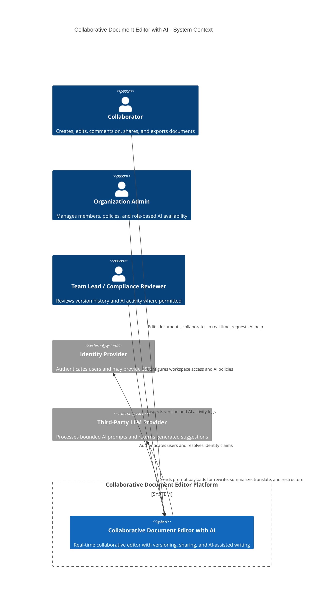
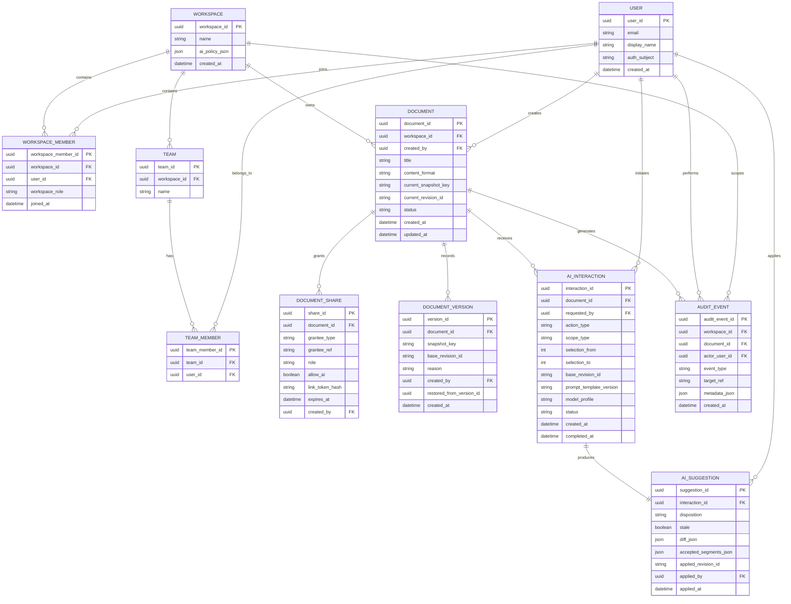

# Part 1: Requirements Engineering

## 1.1 Stakeholder Analysis

### Stakeholder 1: Organization Administrators / Workspace Owners

These are customers who manage a team or organization using the platform.

**Goals**

* Provision users and manage access to shared documents.
* Control which AI features are enabled for their organization.
* Enforce security, privacy, and usage policies.
* Monitor storage usage, collaboration activity, and AI spending.

**Concerns**

* Sensitive documents being exposed to unauthorized users.
* Employees using AI features in ways that violate internal policy.
* Excessive AI usage causing unpredictable cost.
* Difficulty auditing who changed content or shared documents externally.

**Influence on requirements**

* Drives strong role-based access control and document sharing rules.
* Requires administrative controls for AI feature availability.
* Requires auditability of sharing, version changes, and AI interactions.
* Influences quota, budgeting, and feature flag requirements.

---

### Stakeholder 2: Compliance / Security Officers

These stakeholders may not interact with the editor daily, but they strongly shape security and privacy requirements.

**Goals**

* Ensure document data is protected in transit, at rest, and during AI processing.
* Ensure user identity, authorization, and audit trails are reliable.
* Ensure external AI provider usage complies with organizational or legal policies.
* Minimize retention of sensitive prompts and generated text.

**Concerns**

* Leakage of confidential or regulated content to third-party LLM providers.
* Weak access control causing privilege escalation.
* Lack of audit logs for security investigations.
* Long retention of AI prompts exposing sensitive content later.

**Influence on requirements**

* Drives encryption, session management, audit logs, retention policies.
* Requires explicit handling of third-party AI processing.
* Influences requirements for permission checks on every sensitive action.
* Pushes for graceful degradation when AI is disabled for policy reasons.

---

### Stakeholder 3: Product Owners / Startup Business Team

These stakeholders care about market fit, retention, usability, and monetization.

**Goals**

* Deliver a collaboration experience that feels responsive and intuitive.
* Make AI assistance useful enough to differentiate the product.
* Balance feature richness against implementation complexity.
* Support future monetization through usage tiers, premium AI features, or quotas.

**Concerns**

* Slow collaboration or confusing AI workflows causing user churn.
* AI suggestions feeling intrusive, inaccurate, or unsafe.
* Feature scope expanding too quickly and delaying launch.
* Architecture choices limiting future growth.

**Influence on requirements**

* Drives latency targets and usability requirements.
* Influences which AI workflows must be polished first.
* Encourages modular design so features can evolve over time.
* Pushes for versioning, sharing, export, and collaborative UX polish.

---

### Stakeholder 4: Platform Operations / DevOps / SRE Team

These stakeholders operate and maintain the system in production.

**Goals**

* Keep the service available and observable.
* Scale real-time collaboration and API services predictably.
* Limit operational risk from external dependencies such as LLM APIs.
* Recover quickly from incidents without losing user work.

**Concerns**

* Spikes in concurrent editors per document overloading real-time sync services.
* AI provider outages cascading into product-wide failures.
* Unclear service boundaries making debugging difficult.
* Loss of in-progress edits during partial failures.

**Influence on requirements**

* Drives availability and graceful degradation requirements.
* Requires retry, queueing, fallback, and observability mechanisms.
* Influences architecture toward separation of core editing vs. AI services.
* Supports autoscaling, session recovery, and fault-tolerant collaboration design.

---

### Stakeholder 5: AI/LLM Service Providers

This includes external API vendors or an internal model-serving team.

**Goals**

* Receive well-formed requests with bounded context sizes.
* Enforce usage limits and safe invocation patterns.
* Return responses within predictable latency constraints.

**Concerns**

* Excessively large prompts increasing cost and latency.
* Abuse patterns, burst traffic, or malformed requests.
* Ambiguous product expectations when the AI is probabilistic.

**Influence on requirements**

* Pushes prompt construction, context selection, and quota rules.
* Encourages asynchronous handling for longer AI tasks.
* Shapes error handling for quotas, timeouts, and partial failures.
* Forces explicit UX for reviewing AI-generated suggestions before acceptance.

---

### Stakeholder 6: Customer Support / Success Team

These stakeholders help users troubleshoot issues and understand system behavior.

**Goals**

* Explain why edits disappeared, conflicted, or were overwritten.
* Help users restore document versions or recover from sharing mistakes.
* Understand how AI-generated content entered a document.

**Concerns**

* Lack of traceability around edits, versions, or AI actions.
* User confusion over permissions and role restrictions.
* Difficulty diagnosing sync failures or offline edits.

**Influence on requirements**

* Supports version history, audit trails, and activity visibility.
* Drives clear user-facing states for “pending,” “synced,” “failed,” and “offline.”
* Encourages explainable AI suggestion flows rather than silent replacement.

---

## 1.2 Functional Requirements

### Capability Area A: Real-Time Collaboration

**High-level capability statement**
The system shall allow multiple authorized users to edit the same document simultaneously while maintaining a consistent shared document state, visible collaborator presence, and predictable handling of overlapping edits.

#### FR-COL-01: Simultaneous editing

**Description**
The system shall support concurrent editing of the same document by multiple users.

**Triggering condition**
Two or more authorized users have the same document open in edit mode.

**Expected system behavior**
Each user’s edits are transmitted to the collaboration backend and merged into a consistent shared document state without requiring manual refresh.

**Acceptance criteria**

* Given two editors on the same document, when User A inserts text, User B sees the inserted text appear in their editor automatically.
* Given three editors making non-overlapping edits, all edits appear in the final shared state.
* No full page reload is required for remote edits to appear.

#### FR-COL-02: Presence awareness

**Description**
The system shall display which collaborators are currently active in a document and where they are working.

**Triggering condition**
A user opens a collaborative document session.

**Expected system behavior**
The system shows active collaborator identities or labels, online status, and cursor/selection indicators where applicable.

**Acceptance criteria**

* When at least one other user is active, the interface shows their presence within 3 seconds of connection.
* When a collaborator moves their cursor, other collaborators see the updated cursor location.
* When a collaborator disconnects, their presence indicator disappears or changes to offline within 10 seconds.

#### FR-COL-03: Conflict handling for overlapping edits

**Description**
The system shall resolve or surface simultaneous edits to the same region in a predictable way without corrupting document state.

**Triggering condition**
Two users edit overlapping content within a short interval.

**Expected system behavior**
The collaboration layer applies its conflict resolution strategy and updates all clients consistently. If needed, the system indicates that concurrent edits occurred.

**Acceptance criteria**

* The document remains syntactically valid text after overlapping edits.
* All clients converge to the same final content state.
* No edit is silently lost without either being incorporated or surfaced in version history / operation history.

#### FR-COL-04: Offline edit recovery

**Description**
The system shall support temporary client disconnection and recovery of unsynced local edits.

**Triggering condition**
A user loses network connectivity during an editing session and later reconnects.

**Expected system behavior**
The editor preserves unsynced local changes locally, indicates offline status, and attempts reconciliation after reconnection.

**Acceptance criteria**

* If a user types while offline, the UI indicates the document is not fully synced.
* After reconnection, local unsynced edits are either merged successfully or the user is informed of any reconciliation issue.
* No locally typed content is discarded solely because of transient connectivity loss.

---

### Capability Area B: AI Writing Assistant

**High-level capability statement**
The system shall provide AI-assisted text operations on selected document content, including rewrite, summarize, translate, and restructure, through a controlled workflow where suggestions can be reviewed, accepted, rejected, or edited before application.

#### FR-AI-01: AI invocation on selected text

**Description**
The system shall allow an authorized user to invoke AI actions on a selected text range.

**Triggering condition**
A user selects text and chooses an AI action from the UI.

**Expected system behavior**
The system submits the selected text and relevant context to the AI service and shows a pending state for the request.

**Acceptance criteria**

* A user can invoke at least rewrite, summarize, translate, and restructure from the editor UI.
* The request payload includes the selected text and document identifier.
* The UI shows that the AI request is in progress until completion, cancellation, or failure.

#### FR-AI-02: Suggestion presentation

**Description**
The system shall present AI output as a reviewable suggestion rather than applying it silently.

**Triggering condition**
The AI service returns a result.

**Expected system behavior**
The user sees the suggestion in a review interface, such as side-by-side comparison, inline proposal, or tracked-change style display.

**Acceptance criteria**

* AI-generated content is visually distinguishable from current document text.
* The user can compare original text and suggestion before applying changes.
* The system does not overwrite the original text without explicit user confirmation.

#### FR-AI-03: Accept, reject, or modify suggestion

**Description**
The system shall allow the user to accept all, reject all, or manually modify AI-generated suggestions before final insertion.

**Triggering condition**
A suggestion has been returned and is displayed to the user.

**Expected system behavior**
The system applies only the user-approved content to the document and preserves the action in change history.

**Acceptance criteria**

* The user can reject a suggestion without changing the document.
* The user can accept a suggestion and see it inserted into the document.
* The user can edit the suggested text before applying it.
* The resulting applied change is reversible via undo or version history.

#### FR-AI-04: AI permission enforcement

**Description**
The system shall enforce role-based permissions for AI assistant usage.

**Triggering condition**
A user attempts to invoke an AI feature.

**Expected system behavior**
The system checks whether the user’s role and organization policy permit the requested AI action.

**Acceptance criteria**

* If the role is not permitted, the request is blocked before the AI service call is made.
* The UI displays a clear message explaining the restriction.
* An authorized role can successfully access the same feature under the same conditions.

#### FR-AI-05: AI audit trail

**Description**
The system shall record AI interactions linked to user, document, action type, and outcome.

**Triggering condition**
An AI request is created, completed, rejected, applied, or fails.

**Expected system behavior**
The system stores metadata sufficient to reconstruct what was requested and how the suggestion was handled.

**Acceptance criteria**

* Each AI request has a unique identifier.
* Stored metadata includes document ID, user ID, action type, timestamp, and final disposition.
* The system can display an interaction history for a document or section if permitted.

---

### Capability Area C: Document Management

#### FR-DOC-01: Document creation

**Description**
The system shall allow an authenticated user to create a new document.

**Triggering condition**
A user selects “Create document.”

**Expected system behavior**
The system creates a new document record with metadata, ownership, and an initial empty or template-based content state.

**Acceptance criteria**

* A newly created document receives a unique document ID.
* The creating user is assigned owner role for the document.
* The document is accessible immediately after creation.

#### FR-DOC-02: Version history

**Description**
The system shall maintain a retrievable version history for each document.

**Triggering condition**
A document changes through editing, AI application, or manual restore.

**Expected system behavior**
The system records versions or version checkpoints with sufficient metadata to inspect and restore prior states.

**Acceptance criteria**

* Users with appropriate permission can see previous document versions.
* Each version entry includes timestamp and actor metadata.
* A selected prior version can be restored as the current document state.

#### FR-DOC-03: Sharing and access control

**Description**
The system shall allow a document owner or authorized collaborator to share a document with specific users, teams, or links under defined permission levels.

**Triggering condition**
An authorized user opens sharing controls and creates or modifies a share rule.

**Expected system behavior**
The system stores the permission rule and enforces it for subsequent access attempts.

**Acceptance criteria**

* A document can be shared as viewer, commenter, or editor.
* A newly invited user receives only the granted permissions.
* Revoked access prevents further document retrieval or editing.

#### FR-DOC-04: Export

**Description**
The system shall allow users with sufficient permission to export document content to common formats.

**Triggering condition**
A permitted user chooses an export option.

**Expected system behavior**
The system generates and returns the document in the requested format.

**Acceptance criteria**

* The system supports export to at least PDF and DOCX.
* Exported content reflects the user-visible current document state.
* If AI suggestions are unaccepted, they are either excluded or clearly separated according to the chosen export mode.

#### FR-DOC-05: Document retrieval and listing

**Description**
The system shall allow users to list accessible documents and open a selected document.

**Triggering condition**
A user accesses the document dashboard or opens a document link.

**Expected system behavior**
The system returns only documents the user is authorized to access and loads the selected document with metadata and content.

**Acceptance criteria**

* Unauthorized documents do not appear in the user’s document list.
* Opening an accessible document returns its current content and metadata.
* Attempting to open a document without permission returns an appropriate authorization error.

---

### Capability Area D: User Management

**High-level capability statement**
The system shall manage user identity, roles, sessions, and authorization checks so that actions are attributable and access is appropriately controlled.

#### FR-USER-01: Authentication

**Description**
The system shall require users to authenticate before accessing private documents or collaboration features.

**Triggering condition**
A user attempts to access a protected route or perform a protected action.

**Expected system behavior**
The system redirects unauthenticated users to sign in and establishes an authenticated session after successful login.

**Acceptance criteria**

* Unauthenticated users cannot open non-public documents.
* After valid login, the user can access routes allowed by their permissions.
* Invalid credentials do not create a valid session.

#### FR-USER-02: Authorization by role

**Description**
The system shall enforce document- and organization-level roles for all restricted actions.

**Triggering condition**
A user attempts an action such as edit, comment, share, revert version, or invoke AI.

**Expected system behavior**
The system checks the role and permits or denies the action.

**Acceptance criteria**

* A viewer cannot edit document text.
* A commenter can add comments but cannot directly modify document content.
* Only users with required privilege can change share settings or restore versions.

#### FR-USER-03: Session handling

**Description**
The system shall manage active user sessions securely across browser refreshes and inactivity periods.

**Triggering condition**
A user signs in, refreshes a page, becomes inactive, or signs out.

**Expected system behavior**
The system maintains valid sessions until expiration or logout, then requires re-authentication.

**Acceptance criteria**

* Refreshing the page during an active valid session does not require immediate re-login.
* Signing out invalidates the current session.
* Expired sessions cause protected actions to fail with a re-authentication prompt.

#### FR-USER-04: User profile and identity display

**Description**
The system shall associate document activity with a stable user identity visible to collaborators where appropriate.

**Triggering condition**
A user joins a collaboration session or creates edits/comments/AI requests.

**Expected system behavior**
The system tags actions with the user’s identity and shows display name/avatar or equivalent collaborator identifier.

**Acceptance criteria**

* Presence indicators show collaborator identity labels.
* Version history entries include actor identity.
* AI interactions are attributable to the initiating user if the viewer has permission to see the log.

---

## 1.3 Non-Functional Requirements

The assignment requires measurable quality attributes covering latency, scalability, availability, security/privacy, and usability. These should be constraints, not vague aspirations. 

---

### A. Latency Requirements

#### NFR-LAT-01: Keystroke propagation latency

**Requirement**
For collaborators connected under normal network conditions, 95% of remote keystroke updates shall become visible to other active editors within **250 ms**, and 99% within **500 ms**.

**Justification**
Collaboration feels “live” only if remote edits appear nearly immediately. Delays beyond roughly half a second make turn-taking and shared drafting feel disconnected and can cause duplicate work.

#### NFR-LAT-02: AI response initiation latency

**Requirement**
For AI requests using supported prompt sizes within quota, the system shall show request acknowledgment and a visible “AI is generating” state within **1 second** of invocation, and the first result or progress event shall arrive within **5 seconds** for 90% of requests.

**Justification**
Users tolerate slower AI generation more than slow typing sync, but they still need immediate feedback that the action was received. Fast acknowledgment prevents repeated clicks and uncertainty.

#### NFR-LAT-03: Document load latency

**Requirement**
For a document of up to **100 pages equivalent text content** and standard metadata, the initial editor view shall become interactive within **2 seconds** for 90% of loads and within **4 seconds** for 99% of loads on a normal broadband connection.

**Justification**
Opening a document is a frequent action. If load time feels slow, the product seems unreliable before collaboration even begins.

---

### B. Scalability Requirements

#### NFR-SCALE-01: Concurrent editors per document

**Requirement**
The system shall support at least **50 concurrent active editors on a single document** without violating the keystroke propagation latency target under expected load.

**Rationale**
This is a realistic team-based collaboration ceiling for a startup-grade collaborative editor and leaves room for demos, classrooms, or meeting-heavy usage.

#### NFR-SCALE-02: System-wide concurrent documents

**Requirement**
The platform shall support at least **10,000 concurrently open documents system-wide**, with at least **2,000 active collaboration sessions** simultaneously.

**Rationale**
The product must scale beyond a single small team and support multiple organizations with overlapping usage periods.

#### NFR-SCALE-03: Growth model

**Requirement**
The architecture shall support horizontal scaling of stateless API services and real-time session services without requiring document schema redesign.

**Verification**

* Additional service instances can be added without client changes.
* Load tests demonstrate increased total throughput after adding instances.
* Persistent storage design does not assume a single-server deployment.

---

### C. Availability Requirements

#### NFR-AVAIL-01: Service availability target

**Requirement**
The core document editing and retrieval service shall target **99.9% monthly availability** excluding scheduled maintenance.

#### NFR-AVAIL-02: Partial failure handling

**Requirement**
If a non-core dependency such as the AI service becomes unavailable, the document editor, saving, loading, and collaboration features shall remain available.

**Verification**

* During simulated AI service outage, users can still open, edit, save, and collaborate on documents.
* AI actions fail with a clear degraded-mode message rather than causing editor failure.

#### NFR-AVAIL-03: In-progress session resilience

**Requirement**
During transient backend or network interruptions shorter than **60 seconds**, the client shall preserve visible local unsynced edits and attempt automatic reconnection.

**Verification**

* A temporary disconnect does not wipe the local editing buffer.
* After recovery, the session resumes automatically or prompts the user to reload safely.
* The UI indicates sync state during the interruption.

---

### D. Security & Privacy Requirements

#### NFR-SEC-01: Encryption in transit

**Requirement**
All client-server and service-to-service communication containing document content, credentials, or AI payloads shall be encrypted in transit using modern TLS.

#### NFR-SEC-02: Encryption at rest

**Requirement**
Document content, document metadata containing access rules, and stored AI interaction logs shall be encrypted at rest using managed encryption mechanisms provided by the deployment platform or database.

#### NFR-SEC-03: Least-privilege authorization

**Requirement**
Every restricted API action shall enforce authorization checks on the server side, regardless of whether the UI hides or disables the action.

#### NFR-SEC-04: Third-party AI disclosure and control

**Requirement**
If document content is sent to a third-party LLM provider, the system shall explicitly classify this as external processing and provide organization-level controls to enable, restrict, or disable such processing.

**Implication**
Some organizations may permit internal collaboration but forbid external AI processing; this must be enforceable.

#### NFR-SEC-05: AI log retention policy

**Requirement**
AI interaction logs shall retain only the minimum metadata required for audit and product support by default, and any stored prompt/response content shall have a configurable retention period not exceeding **30 days** unless explicitly overridden by organization policy.

**Justification**
AI logs are useful for auditability, but they can contain highly sensitive content. Default minimization reduces long-term exposure.

---

### E. Usability Requirements

#### NFR-USA-01: Managing crowded collaboration views

**Requirement**
When more than **10 collaborators** are active in a document, the UI shall collapse presence indicators into a summarized display while preserving the ability to inspect the full participant list.

**Reasoning**
Showing every cursor and avatar at once becomes visually overwhelming in dense collaboration sessions.

#### NFR-USA-02: Large document navigation

**Requirement**
For large documents, the editor shall provide outline/navigation aids and defer non-critical rendering so users can begin reading or editing before the entire document is fully processed.

#### NFR-USA-03: Accessibility

**Requirement**
Core workflows—open document, edit text, comment, review AI suggestion, accept/reject suggestion, and manage sharing—shall be operable via keyboard and support screen-reader-readable labels for controls and state changes.

**Verification**

* No core flow requires mouse-only interaction.
* Interactive controls expose accessible names.
* Status changes such as “AI suggestion ready” or “offline” are announced or available to assistive technologies.

#### NFR-USA-04: Error clarity

**Requirement**
When an action fails, the user interface shall provide a specific error state distinguishing at least: permission denied, offline/disconnected, AI unavailable, request still processing, and quota exceeded.

---

## 1.4 User Stories and Scenarios

### Collaboration Stories

#### US-01: Simultaneous paragraph editing

**As an** editor
**I want** to edit a paragraph while another editor is also working in the same document
**so that** we can collaborate in real time without manually merging drafts.

**Expected behavior**
When both users edit different parts of the same document, changes should appear in near real time on both screens. If both edit the same paragraph, the system should keep the document consistent and avoid silent loss of either user’s work. A subtle indication that overlapping edits occurred is preferable to invisible overwriting.

**Justification**
Silent overwrite is the worst possible outcome because it destroys trust in collaborative editing.

---

#### US-02: Offline mid-edit and reconnect

**As an** editor
**I want** my local changes preserved when I temporarily lose internet connectivity
**so that** I do not lose work because of a short network interruption.

**Expected behavior**
The UI should show “offline” or “reconnecting,” allow continued local typing, and mark unsynced changes clearly. Upon reconnection, the system should merge queued changes if possible or surface a recoverable conflict state if necessary.

**Justification**
Users often work on unstable networks; preserving intent matters more than forcing immediate sync.

---

#### US-03: Revert to previous version while others are editing

**As a** document owner
**I want** to restore a previous document version
**so that** I can recover from a mistaken change or AI application.

**Expected behavior**
Because reverting while others are live-editing is non-obvious, the system should treat the restore as a new versioned change rather than deleting history. Active collaborators should see a clear notification that the document was restored to an earlier state and continue from that new shared state.

**Justification**
A restore should be auditable and reversible, not destructive history erasure.

---

### AI Assistant Workflow Stories

#### US-04: Summarize a selected paragraph

**As an** editor
**I want** to select a long paragraph and request a summary
**so that** I can condense content quickly for a report or abstract.

**Expected behavior**
The AI uses the selected text plus limited nearby context if needed, then returns a suggestion in a review view. The original text remains unchanged until the user accepts or edits the suggestion.

---

#### US-05: Translate a section to another language

**As an** editor
**I want** to translate a selected section into another language
**so that** I can prepare multilingual versions of a document.

**Expected behavior**
The UI should let the user choose the target language before invocation. The result should appear as a suggestion or replaceable block, not an automatic overwrite. Formatting and paragraph boundaries should be preserved as much as possible.

---

#### US-06: Restructure a document outline

**As an** editor
**I want** the AI to restructure a messy draft into a cleaner outline
**so that** I can improve organization before refining wording.

**Expected behavior**
This action may require more than the local selection, so the system should clarify or define that the AI uses the current section or full document outline. The output should be shown in a side panel or structured diff view because a large-scale rewrite is too disruptive for direct inline replacement.

**Justification**
Large structural changes are harder to review than sentence rewrites and need a safer UX.

---

#### US-07: Partially accept and partially modify AI output

**As an** editor
**I want** to use some parts of an AI suggestion but rewrite other parts myself
**so that** I stay in control of the final wording.

**Expected behavior**
The user should be able to copy individual sentences, edit the suggestion before applying it, or accept the change and then immediately undo/adjust it. The system should not force an all-or-nothing decision.

**Justification**
AI output is often useful as a draft, not as a final answer.

---

#### US-08: AI suggestion while collaborators edit the same region

**As an** editor
**I want** clear behavior when I request an AI rewrite of text that someone else is also editing
**so that** collaboration does not become confusing.

**Expected behavior**
The system should mark the region as “AI suggestion pending” for the requester, but should not hard-lock the region for everyone by default. Other collaborators may continue editing; when the AI result arrives, it is shown as a proposal against the latest text state or flagged if the basis text has changed substantially.

**Justification**
Hard locks interrupt collaboration too aggressively. Proposal-based reconciliation is safer and preserves workflow.

---

### Document Lifecycle Stories

#### US-09: Share with read-only access

**As a** document owner
**I want** to share a document with a teammate as read-only
**so that** they can review it without changing content.

**Expected behavior**
The invited user can open and read the document, but edit controls are disabled and write requests are rejected server-side if attempted through direct API calls.

---

#### US-10: Export document with AI-suggested changes separated

**As an** editor
**I want** to export a document while keeping AI-suggested but unaccepted changes separate
**so that** I can review them later or share them with a manager.

**Expected behavior**
The export flow should allow at least two modes: export current accepted content only, or export with suggestion annotations/appendix if supported. The export should clearly distinguish accepted document content from proposals not yet applied.

---

#### US-11: Review AI interaction history

**As a** team lead or owner
**I want** to review the AI interaction history for a document
**so that** I can understand how important sections evolved and whether AI was used appropriately.

**Expected behavior**
The system should show which user invoked which AI action, on what section or document region, and whether the result was accepted, rejected, or modified. Access should be permission-controlled because these logs may reveal sensitive intermediate drafting content.

---

### Access Control and Roles Stories

#### US-12: Commenter attempts to invoke AI

**As a** commenter
**I want** the system to clearly tell me whether I can use AI on a document
**so that** I understand my permissions without trial and error.

**Expected behavior**
If commenters are not allowed to invoke AI, the AI controls should be disabled or clearly labeled as unavailable. If they attempt invocation anyway, the system should return a permission error explaining the role restriction rather than a vague failure.

---

#### US-13: Organization admin configures role-based AI access

**As an** organization admin
**I want** to configure which roles can use which AI features
**so that** I can align the platform with company policy and cost controls.

**Expected behavior**
The admin can enable or disable features such as summarize, translate, or restructure by role or workspace policy. These rules are enforced both in the UI and backend.

---

#### US-14: Viewer attempts to edit

**As a** viewer
**I want** the system to prevent edits gracefully
**so that** I do not accidentally think I changed content when I was only reviewing.

**Expected behavior**
The editor appears in read-only mode, the caret is either non-editing or clearly restricted, and any attempted write operation is blocked with a readable explanation.

---

## 1.5 Requirements Traceability Matrix

The assignment asks for a matrix linking user stories to functional requirements to architecture components from Part 2. The matrix below uses the same architectural component identifiers that are defined and explained in Part 2 so that the requirements, architecture, and later proof-of-concept remain traceable. 

### Architecture components referenced in Part 2

* **AC-01 Frontend Editor UI**
* **AC-02 Collaboration / Real-Time Sync Service**
* **AC-03 Backend API Service**
* **AC-04 Document Service**
* **AC-05 Versioning Service**
* **AC-06 Auth & Authorization Service**
* **AC-07 AI Orchestration Service**
* **AC-08 AI Provider Adapter**
* **AC-09 Export Service**
* **AC-10 Audit / Activity Log Service**
* **AC-11 Presence Service**
* **AC-12 Document Database / Storage**

---

### Traceability Matrix

| User Story                                                | Supported Functional Requirements      | Supporting Architecture Components |
| --------------------------------------------------------- | -------------------------------------- | ---------------------------------- |
| US-01 Simultaneous paragraph editing                      | FR-COL-01, FR-COL-03                   | AC-01, AC-02, AC-03, AC-12         |
| US-02 Offline mid-edit and reconnect                      | FR-COL-04                              | AC-01, AC-02, AC-03                |
| US-03 Revert to previous version while others are editing | FR-DOC-02, FR-COL-01, FR-COL-03        | AC-01, AC-02, AC-05, AC-04, AC-12  |
| US-04 Summarize a selected paragraph                      | FR-AI-01, FR-AI-02, FR-AI-03           | AC-01, AC-03, AC-07, AC-08         |
| US-05 Translate a section                                 | FR-AI-01, FR-AI-02, FR-AI-03           | AC-01, AC-03, AC-07, AC-08         |
| US-06 Restructure a document outline                      | FR-AI-01, FR-AI-02, FR-AI-03, FR-AI-05 | AC-01, AC-03, AC-07, AC-10         |
| US-07 Partially accept and modify AI output               | FR-AI-02, FR-AI-03                     | AC-01, AC-03, AC-07, AC-05         |
| US-08 AI suggestion during concurrent editing             | FR-AI-01, FR-AI-02, FR-COL-03          | AC-01, AC-02, AC-07, AC-03         |
| US-09 Share with read-only access                         | FR-DOC-03, FR-USER-02                  | AC-01, AC-03, AC-04, AC-06, AC-12  |
| US-10 Export with AI changes separated                    | FR-DOC-04, FR-AI-05                    | AC-01, AC-03, AC-09, AC-10         |
| US-11 Review AI interaction history                       | FR-AI-05, FR-USER-02                   | AC-01, AC-03, AC-10, AC-06         |
| US-12 Commenter attempts to invoke AI                     | FR-AI-04, FR-USER-02                   | AC-01, AC-03, AC-06, AC-07         |
| US-13 Admin configures role-based AI access               | FR-AI-04, FR-USER-02                   | AC-01, AC-03, AC-06                |
| US-14 Viewer attempts to edit                             | FR-USER-02, FR-DOC-05                  | AC-01, AC-03, AC-06, AC-04         |

# Part 2: System Architecture

## 2.1 Architectural Drivers

The architecture is driven first by the collaboration experience and only second by implementation convenience. That ranking matters: if the top priority were “ship the simplest CRUD app quickly,” a single synchronous backend with periodic saves would be enough. That would not satisfy the requirements in Part 1, especially FR-COL-01, FR-COL-03, FR-COL-04, NFR-LAT-01, NFR-AVAIL-03, and the AI-review workflows in FR-AI-02 and FR-AI-03.

| Rank | Architectural driver | Requirements that force it | Why it dominates the design |
| --- | --- | --- | --- |
| 1 | Low-latency, consistent real-time collaboration | FR-COL-01, FR-COL-02, FR-COL-03, FR-COL-04, NFR-LAT-01 | The product fails if collaboration feels delayed or if edits are lost. This drives a dedicated real-time synchronization path, local-first editor state, and an algorithm that converges after overlapping edits and reconnects. |
| 2 | Failure isolation and graceful degradation | NFR-AVAIL-01, NFR-AVAIL-02, NFR-AVAIL-03 | The core editor must continue working even if AI is slow or unavailable. This drives a separation between the collaboration path and the AI path, plus asynchronous job handling and reconnection logic. |
| 3 | Security, privacy, and auditable authorization | FR-DOC-03, FR-USER-01, FR-USER-02, FR-AI-04, FR-AI-05, NFR-SEC-01 to NFR-SEC-05 | Sensitive documents and third-party AI processing require explicit policy checks, least-privilege access, audit trails, and bounded prompt construction. |
| 4 | Reviewable, non-destructive AI assistance | FR-AI-02, FR-AI-03, US-07, US-08 | AI output must behave like a proposal, not a silent overwrite. This drives suggestion objects, base-revision tracking, partial acceptance, and stale-suggestion handling during concurrent editing. |
| 5 | Horizontal scalability under document and session growth | NFR-SCALE-01, NFR-SCALE-02, NFR-SCALE-03 | Supporting many active documents and dozens of editors per document requires stateless API scaling, horizontally scalable real-time nodes, and storage that does not assume a single application server. |
| 6 | Team velocity and architectural evolvability | Part 2.3, Part 4 PoC requirements | The team must build a working PoC and continue evolving it across the semester. This drives a monorepo with shared contracts, explicit module boundaries, and a provider abstraction around AI. |

Two different rankings would produce a different design. For example, if cost minimization were ranked above collaboration fidelity, a polling-based editor with no dedicated real-time service and only on-demand AI calls would be plausible. This architecture instead prioritizes a trustworthy live-editing experience and therefore accepts the complexity of a specialized synchronization layer.

## 2.2 System Design using the C4 Model

The architecture uses the same component IDs introduced in Section 1.5:

* **AC-01 Frontend Editor UI**
* **AC-02 Collaboration / Real-Time Sync Service**
* **AC-03 Backend API Service**
* **AC-04 Document Service**
* **AC-05 Versioning Service**
* **AC-06 Auth & Authorization Service**
* **AC-07 AI Orchestration Service**
* **AC-08 AI Provider Adapter**
* **AC-09 Export Service**
* **AC-10 Audit / Activity Log Service**
* **AC-11 Presence Service**
* **AC-12 Document Database / Storage**

At a high level, the system separates the editing path from the AI path. Real-time changes flow through AC-02 for low latency and convergence, while slower AI operations flow through AC-07 so that AI latency or failure does not interrupt normal editing.

### Level 1 - System Context Diagram



**Explanation**
This level shows the platform as a single system. The important architectural observation is that the product depends on two external systems with very different failure and trust characteristics: the identity provider is required for access control, while the LLM provider is optional and must never be allowed to break core document editing.

### Level 2 - Container Diagram

```mermaid
%%{init: {'c4': {'diagramMarginX': 80, 'diagramMarginY': 55, 'c4ShapeMargin': 180, 'boxMargin': 40}}}%%
C4Container
title Collaborative Document Editor with AI - Container Diagram
Person(editor, "Collaborator", "Uses the web editor and AI assistant")
Person(admin, "Organization Admin", "Manages sharing, roles, and AI policy")
System_Ext(idp, "Identity Provider", "OIDC / SSO provider")
System_Ext(llm, "Third-Party LLM Provider", "Hosted LLM API")

System_Boundary(prod, "Collaborative Document Editor Platform") {
  Container(web, "AC-01 Frontend Editor UI", "React + TipTap/ProseMirror + Yjs client", "Rich-text editing, local document state, AI review panel, offline/reconnect UX")
  Container(api, "AC-03 Backend API Service", "NestJS REST API", "Document CRUD, sharing, versioning, export, audit APIs, and session bootstrap")
  Container(sync, "AC-02 Collaboration / Real-Time Sync Service", "Yjs/Hocuspocus-style WebSocket service", "Merges collaborative updates, maintains awareness, and broadcasts presence")
  Container(ai, "AC-07 AI Orchestration Service", "Node.js worker/service with queue processing", "Builds prompts, enforces AI policy and quotas, calls the LLM provider, and stores suggestion results")
  ContainerDb(db, "Platform Metadata DB", "PostgreSQL", "Users, workspaces, document metadata, shares, versions, AI interaction metadata, and audit logs")
  ContainerDb(blob, "Snapshot / Export Storage", "S3-compatible object storage", "Document snapshots, version checkpoints, and generated exports")
  Container(queue, "Redis", "Redis", "Ephemeral pub/sub, presence fan-out, and AI job queue")
}

UpdateLayoutConfig($c4ShapeInRow="4", $c4BoundaryInRow="1")

Rel(editor, web, "Reads, edits, comments, reviews suggestions", "HTTPS")
Rel(admin, web, "Manages policy and permissions", "HTTPS")
Rel(web, api, "Loads documents, manages versions/shares, requests AI jobs", "JSON/HTTPS")
Rel(web, sync, "Joins live editing session and receives presence updates", "WebSocket")
Rel(api, db, "Reads/writes metadata and audit records", "SQL")
Rel(api, blob, "Reads/writes document snapshots and export files", "Object storage API")
Rel(api, queue, "Publishes session and AI job events", "Redis protocol")
Rel(sync, queue, "Pub/sub for room fan-out and AC-11 Presence Service state", "Redis protocol")
Rel(sync, db, "Reads document/session metadata and checkpoint references", "SQL")
Rel(sync, blob, "Reads/writes CRDT snapshots", "Object storage API")
Rel(ai, queue, "Consumes AI jobs and publishes status events", "Redis protocol")
Rel(ai, db, "Reads policy and stores AI interaction metadata", "SQL")
Rel(ai, blob, "Loads relevant snapshots and stores generated artifacts when needed", "Object storage API")
Rel(ai, llm, "Sends prompt payloads and receives completions", "HTTPS")
Rel(api, idp, "Verifies identity and session claims", "OIDC / token verification")
```



**Explanation**
The container split is intentional. AC-01 is optimized for responsive editing and local recovery. AC-02 handles low-latency synchronization and AC-11 presence tracking. AC-03 owns stable business APIs and security-sensitive resource checks. AC-07 isolates long-running, failure-prone, and cost-sensitive AI work. AC-12 is implemented as a persistence layer combining PostgreSQL for metadata and object storage for snapshots and exports.

#### Container responsibilities, technology choices, and communication

| Container | Main responsibility | Technology choice | Communication |
| --- | --- | --- | --- |
| AC-01 Frontend Editor UI | Rich-text editor, local state, collaborator presence, AI suggestion review | React, TipTap/ProseMirror, Yjs client, TypeScript | HTTPS to AC-03, WebSocket to AC-02 |
| AC-03 Backend API Service | Resource APIs, session bootstrap, permissions, versions, audit, export | NestJS REST API | HTTPS with AC-01, SQL to PostgreSQL, object storage API, Redis publish |
| AC-02 Collaboration / Real-Time Sync Service | Real-time document updates, awareness, reconnect flow, AC-11 Presence Service | Yjs/Hocuspocus-style server over WebSocket | WebSocket with AC-01, Redis pub/sub, storage APIs for snapshots |
| AC-07 AI Orchestration Service | AI job execution, prompt building, policy/quota checks, AI result persistence | Node.js worker/service with queue consumer | Redis queue, SQL/object storage reads, HTTPS to LLM provider |
| AC-12 Document Database / Storage | Persistent metadata, snapshots, versions, exports | PostgreSQL plus S3-compatible object storage | SQL and object storage APIs |
| Redis | Fan-out, presence, and queueing infrastructure | Redis | Internal infrastructure only; not directly exposed to clients |

### Level 3 - Component Diagram for AC-07 AI Orchestration Service

```mermaid
%%{init: {'c4': {'diagramMarginX': 90, 'diagramMarginY': 70, 'c4ShapeMargin': 180, 'boxMargin': 45, 'c4ShapePadding': 18}}}%%
C4Component
title AC-07 AI Orchestration Service - Component Diagram
Container(api, "AC-03 Backend API Service", "NestJS REST API", "Creates AI jobs and reads suggestions")
System_Ext(llm, "Third-Party LLM Provider", "Hosted LLM API")
ContainerDb(db, "Platform Metadata DB", "PostgreSQL", "Policies, AI interactions, suggestion metadata")
ContainerDb(blob, "Snapshot / Export Storage", "S3-compatible object storage", "Snapshots and large artifacts")
Container(sync, "AC-02 Collaboration / Real-Time Sync Service", "WebSocket service", "Publishes job status to collaborators")

Container_Boundary(ai, "AC-07 AI Orchestration Service") {
  Component(policyGuard, "Policy & Quota Guard", "Domain service", "Checks policy, entitlement, and quota")
  Component(requestHandler, "AI Job Handler", "Queue consumer / application service", "Validates jobs and coordinates execution")
  Component(contextResolver, "Context Resolver", "Domain service", "Loads selection context and revision metadata")
  Component(promptRegistry, "Prompt Template Registry", "Versioned template catalog", "Resolves prompt templates and model settings")
  Component(eventPublisher, "Result Publisher", "Event publisher", "Publishes job status events to the session")
  Component(providerAdapter, "AC-08 AI Provider Adapter", "Provider abstraction", "Maps requests and responses to the LLM provider")
  Component(suggestionComposer, "Suggestion Composer", "Diff and proposal builder", "Builds reviewable suggestions and stale/conflict flags")
  Component(auditLogger, "AI Audit Logger", "Persistence component", "Stores interaction records and disposition metadata")
}

UpdateLayoutConfig($c4ShapeInRow="4", $c4BoundaryInRow="1")

Rel(api, requestHandler, "Enqueue AI job")
Rel(requestHandler, policyGuard, "Check policy and quota")
Rel(requestHandler, contextResolver, "Load document context")
Rel(requestHandler, promptRegistry, "Load prompt template")
Rel(requestHandler, providerAdapter, "Call provider adapter")
Rel(providerAdapter, llm, "Generate completion")
Rel(requestHandler, suggestionComposer, "Build reviewable suggestion")
Rel(suggestionComposer, auditLogger, "Persist result metadata")
Rel(auditLogger, db, "Write interaction metadata")
Rel(contextResolver, db, "Read metadata refs")
Rel(contextResolver, blob, "Read large snapshots")
Rel(requestHandler, eventPublisher, "Publish job status")
Rel(eventPublisher, sync, "Push status to collaborators")
```



**Explanation**
This container is responsible for turning an AI request into a reviewable suggestion rather than a direct document mutation. AC-08 hides vendor-specific APIs from the rest of the system. The Context Resolver and Suggestion Composer are critical because they connect AI output back to a specific document range, base revision, and later accept/reject/partial-apply flow.

### Feature Decomposition

The system is decomposed into modules that can be developed and tested with limited coupling. The frontend, API, real-time, AI, and persistence layers all depend on shared contracts, but they do not share runtime state directly.

| Module | What it does | Depends on | Interface exposed to other modules |
| --- | --- | --- | --- |
| AC-01 Frontend Editor UI | Renders the editor, manages local document state, displays collaborator presence, shows AI suggestions, and handles offline/reconnect UX | Shared contracts package, AC-03 APIs, AC-02 session token and WebSocket channel | React components, editor commands, API client methods, WebSocket event handlers |
| AC-02 Collaboration / Real-Time Sync Service | Accepts document updates, merges concurrent edits, distributes remote updates, and hosts AC-11 Presence Service | Redis pub/sub, AC-12 snapshots, session claims from AC-03 | WebSocket room protocol: `doc.update`, `doc.sync`, `presence.update`, `sync.state` |
| AC-11 Presence Service | Tracks who is connected, active cursors, and summarized presence state for crowded documents | AC-02 session room, Redis | Presence payloads to AC-01; collaborator list and cursor metadata |
| AC-03 Backend API Service | Entry point for document CRUD, versioning, sharing, export, session bootstrap, and AI job creation | AC-04, AC-05, AC-06, AC-09, AC-10, AC-07 | REST/JSON endpoints under `/api/...` |
| AC-04 Document Service | Creates documents, loads metadata, resolves current snapshot pointers, and enforces document lifecycle rules | AC-06, AC-12 | Internal service methods and REST handlers such as `POST /documents`, `GET /documents/{id}` |
| AC-05 Versioning Service | Creates immutable checkpoints, lists version history, and restores previous versions as new current versions | AC-04, AC-06, AC-12 | `GET /documents/{id}/versions`, `POST /documents/{id}/versions/{versionId}/restore` |
| AC-06 Auth & Authorization Service | Verifies identity claims, evaluates workspace role plus document role, and gates AI usage by policy | Identity provider claims, workspace policy tables, share records | `authorize(user, action, resource)` and permission metadata returned to the client |
| AC-07 AI Orchestration Service | Executes AI jobs, builds prompts, selects models, and publishes suggestion results | AC-06 policy data, AC-12, AC-08 | AI job queue interface and status events |
| AC-08 AI Provider Adapter | Normalizes calls to the chosen LLM provider and shields the rest of the system from vendor changes | Third-party LLM API | Provider-independent `generate(prompt, schema, modelProfile)` interface |
| AC-09 Export Service | Produces PDF/DOCX exports from the current snapshot and optionally annotates pending AI suggestions | AC-04, AC-05, AC-12 | `POST /documents/{id}/exports` |
| AC-10 Audit / Activity Log Service | Records version restores, sharing changes, AI requests, AI outcomes, and security-relevant events | AC-06, AC-12 | Audit write interface and read APIs for permitted reviewers |
| AC-12 Document Database / Storage | Stores metadata, access rules, versions, snapshots, AI logs, and exports | PostgreSQL, object storage | Persistence contracts used by AC-02, AC-03, and AC-07 |

### AI Integration Design

#### Context and scope

The AI assistant should not always see the full document. The default rule is to send the minimum context necessary for the requested feature.

| AI feature | Context sent to the model | Why this scope is chosen | Long-document handling |
| --- | --- | --- | --- |
| Rewrite | Selected text plus the previous and next paragraph, document title, and style hints | Keeps prompts small while preserving tone and local coherence | If the selection exceeds the token budget, chunk by paragraph and synthesize a final rewrite candidate |
| Summarize | Selected text or the current section; optionally section heading path | Summaries depend on the section, not necessarily the full document | Summarize chunks first, then combine them into a second-stage summary |
| Translate | Selected text plus requested target language and glossary/terminology hints | Translation quality benefits more from term hints than from full-document context | Translate in formatting-preserving chunks if the selection is long |
| Restructure | Section outline plus current section content; full document outline only when small enough | Structural changes need broader context than sentence rewrites | For large documents, first generate an outline from headings and section summaries, then propose section-level restructuring |

This scope policy directly balances cost, relevance, and latency. Full-document prompting is reserved for small documents or outline-only operations because it is the most expensive and slowest option and increases privacy exposure.

#### Suggestion UX

AI output is presented as a reviewable suggestion, never as a silent replacement. The UX has two modes:

* **Inline tracked-change style proposal** for local rewrites, summaries inserted below selection, and translation replacements of a bounded selection.
* **Side-panel proposal** for larger restructures or section-level rewrites where direct inline replacement would be visually disruptive.

Users can:

* accept the full suggestion,
* reject it with no document mutation,
* edit the suggestion text before applying it,
* partially accept it by applying only selected diff blocks or sentences,
* undo an accepted suggestion through normal editor undo and version history.

Each suggestion is tied to a `baseRevisionId` so that the system knows what text the model actually saw.

#### AI during collaboration

The architecture does **not** hard-lock the selected region by default. That would protect consistency but would harm the core collaboration experience. Instead:

1. When a user invokes AI, the selected range is marked locally as `AI pending`, and collaborators can see a lightweight indicator that an AI proposal is being generated.
2. Other collaborators may continue editing the document, including the same region.
3. When the result arrives, the system compares the original `baseRevisionId` and text hash with the latest state.
4. If the region has only changed slightly, the Suggestion Composer rebases the proposal onto the latest revision and shows it as a normal suggestion.
5. If the region has changed substantially, the suggestion is marked `stale` and shown with an explanation such as “The source text changed while the AI was generating. Review before applying.”

This gives all collaborators a predictable experience: work continues, but AI proposals are explicitly treated as proposals against a moving shared state.

#### Prompt design

Prompt logic is **template-based and versioned**, not hardcoded in controller code. Each AI feature has:

* a versioned system prompt,
* task-specific variables such as tone, target language, or structure style,
* response schema instructions so the provider returns structured output where possible,
* guardrails telling the model to preserve facts and avoid unrequested changes.

Prompt templates live in a dedicated prompt catalog package and can also be overridden by a database-backed configuration table for selected workspaces. That means prompt wording can evolve without redeploying the whole application, while prompt versions remain auditable in AI interaction records.

#### Model and cost strategy

The platform uses different model profiles for different AI tasks:

* **Fast/low-cost model** for short rewrite, summarize, and translate requests.
* **Higher-quality model** for restructure and long-context summarization jobs.

Cost is controlled at two levels:

* **Per-user quotas** to prevent one user from exhausting shared capacity.
* **Organization-level budgets and feature policies** so admins can disable expensive features or cap monthly usage.

When a user exceeds the allowed limit, AC-07 returns a quota-specific error and publishes a `quota_exceeded` job state. The editor remains fully usable for manual editing; only new AI requests are blocked until the quota resets or an administrator changes the policy.

### API Design

The API layer uses different interaction styles for different problems:

* **REST/JSON** for stable resource operations such as document CRUD, sharing, versions, export, and policy management.
* **WebSocket** for low-latency collaborative updates and presence because polling would not satisfy NFR-LAT-01.
* **Asynchronous job pattern** for AI because LLM calls are slow, failure-prone, and quota-bound.

#### Document CRUD and versioning

| Method | Path | Purpose | Key request / response fields |
| --- | --- | --- | --- |
| `POST` | `/api/documents` | Create a new document | Request: `title`, `workspaceId`, `initialContent?`; Response: `documentId`, `latestVersionId`, `role`, `content` |
| `GET` | `/api/documents` | List documents visible to the current user | Response: paged list with `documentId`, `title`, `updatedAt`, `role`, `preview` |
| `GET` | `/api/documents/{documentId}` | Load document metadata and current snapshot reference | Response: `documentId`, `title`, `content`, `latestVersionId`, `permissions`, `sharingSummary` |
| `PATCH` | `/api/documents/{documentId}` | Update document metadata or PoC-style non-live content fields | Request: `title?`, `status?`, `content?`; Response: updated document resource |
| `DELETE` | `/api/documents/{documentId}` | Soft-delete or archive a document | Response: `204 No Content` |
| `GET` | `/api/documents/{documentId}/versions` | List immutable checkpoints | Response: array of `versionId`, `createdAt`, `actor`, `reason` |
| `POST` | `/api/documents/{documentId}/versions/{versionId}/restore` | Restore an older version as a new current version | Response: `restoredVersionId`, `latestVersionId`, `restoredFromVersionId` |

Example create contract:

```json
POST /api/documents
{
  "title": "Q2 Launch Plan",
  "workspaceId": "ws_123",
  "initialContent": {
    "type": "doc",
    "content": []
  }
}
```

```json
201 Created
{
  "documentId": "doc_456",
  "title": "Q2 Launch Plan",
  "latestVersionId": "ver_001",
  "role": "owner",
  "contentFormat": "prosemirror-json",
  "content": {
    "type": "doc",
    "content": []
  }
}
```

#### Real-time session management

| Method / channel | Path | Purpose | Key fields |
| --- | --- | --- | --- |
| `POST` | `/api/documents/{documentId}/sessions` | Bootstrap a collaboration session after permission checks | Response: `sessionId`, `websocketUrl`, `realtimeToken`, `baseRevisionId`, `presenceUser` |
| `WS` | `/realtime/documents/{documentId}?token=...` | Join the live editing room | Events: `doc.sync`, `doc.update`, `presence.update`, `sync.state`, `ai.job.status` |

Example session bootstrap response:

```json
{
  "sessionId": "sess_789",
  "websocketUrl": "wss://api.example.com/realtime/documents/doc_456",
  "realtimeToken": "signed-short-lived-token",
  "baseRevisionId": "rev_1042",
  "presenceUser": {
    "userId": "usr_001",
    "displayName": "Alice",
    "color": "#1f6feb"
  }
}
```

Example event envelope:

```json
{
  "type": "ai.job.status",
  "documentId": "doc_456",
  "jobId": "ai_222",
  "status": "ready",
  "suggestionId": "sug_333"
}
```

#### AI assistant invocation

| Method | Path | Purpose | Key request / response fields |
| --- | --- | --- | --- |
| `POST` | `/api/documents/{documentId}/ai-jobs` | Create an AI request against a selection or section | Request: `action`, `scope`, `selectionRange`, `baseRevisionId`, `options`; Response: `jobId`, `status`, `queuedAt`, `quotaRemaining?` |
| `GET` | `/api/ai-jobs/{jobId}` | Fetch current job status when event subscription is unavailable | Response: `status`, `suggestionId?`, `errorCode?`, `message?` |
| `GET` | `/api/ai-jobs/{jobId}/suggestion` | Load the generated suggestion payload | Response: `originalText`, `suggestedText`, `diff`, `baseRevisionId`, `stale` |
| `POST` | `/api/ai-jobs/{jobId}/apply` | Apply all or part of a suggestion | Request: `mode`, `selectedDiffBlocks?`, `targetRevisionId`; Response: `appliedVersionId`, `newRevisionId` |
| `POST` | `/api/ai-jobs/{jobId}/reject` | Explicitly reject a suggestion and persist the outcome | Response: `status: rejected` |

Example AI request:

```json
POST /api/documents/doc_456/ai-jobs
{
  "action": "summarize",
  "scope": "selection",
  "selectionRange": {
    "from": 120,
    "to": 480
  },
  "baseRevisionId": "rev_1042",
  "options": {
    "tone": "professional",
    "targetLanguage": null
  }
}
```

```json
202 Accepted
{
  "jobId": "ai_222",
  "status": "queued",
  "queuedAt": "2026-03-17T10:15:00Z"
}
```

#### User, sharing, and permission management

| Method | Path | Purpose | Key fields |
| --- | --- | --- | --- |
| `GET` | `/api/me` | Load the current user profile and workspace memberships | Response: `userId`, `displayName`, `workspaceRoles`, `featureEntitlements` |
| `POST` | `/api/documents/{documentId}/shares` | Grant user, team, or link-based access | Request: `granteeType`, `granteeIdOrEmail`, `role`, `expiresAt?`, `allowAi?` |
| `PATCH` | `/api/documents/{documentId}/shares/{shareId}` | Modify an existing share rule | Request: `role?`, `expiresAt?`, `allowAi?` |
| `DELETE` | `/api/documents/{documentId}/shares/{shareId}` | Revoke access | Response: `204 No Content` |
| `PATCH` | `/api/workspaces/{workspaceId}/ai-policy` | Change role-based AI feature availability or budgets | Request: `allowedRolesByFeature`, `monthlyBudget`, `perUserQuota` |
| `GET` | `/api/documents/{documentId}/audit` | View audit trail when authorized | Response: array of activity events |

#### Long-running AI operations and error handling

From the client perspective, AI is a job with explicit states: `queued`, `running`, `ready`, `stale`, `failed`, or `quota_exceeded`. The client subscribes to `ai.job.status` events over the existing document session channel; if the WebSocket is unavailable, it falls back to `GET /api/ai-jobs/{jobId}` polling.

This lets the client distinguish:

* **“The AI is slow”**: job remains in `queued` or `running`.
* **“The AI failed”**: job becomes `failed` with `errorCode` such as `AI_PROVIDER_TIMEOUT` or `AI_PROVIDER_UNAVAILABLE`.
* **“You have exceeded your quota”**: request is rejected with HTTP `429` or transitions to `quota_exceeded`.

Other important status codes are:

* `401 Unauthorized` for missing/expired session
* `403 Forbidden` for role or policy restrictions
* `409 Conflict` for stale base revision or apply-on-old-version attempts
* `422 Unprocessable Entity` for invalid selection ranges or malformed requests
* `503 Service Unavailable` when the AI provider is down but the editor itself remains available

### Authentication & Authorization

Authentication is required because the system contains private documents, auditable change history, and quota-controlled AI features. The platform expects several user types:

* workspace members,
* invited external collaborators,
* organization administrators,
* reviewers such as team leads or compliance staff with narrow audit access,
* link-based guests with restricted read or comment permissions.

Document access is controlled by both workspace membership and document-specific sharing rules. The main roles and actions are:

| Role | Read | Comment | Edit | Share | Restore versions | Invoke AI | Review AI history |
| --- | --- | --- | --- | --- | --- | --- | --- |
| Owner | Yes | Yes | Yes | Yes | Yes | Yes | Yes |
| Editor | Yes | Yes | Yes | If granted | If granted | Yes if policy allows | Usually no unless explicitly granted |
| Commenter | Yes | Yes | No | No | No | Optional, policy-controlled | No |
| Viewer | Yes | No | No | No | No | No | No |
| Workspace Admin | Policy-driven across workspace | Policy-driven | Policy-driven | Can manage workspace defaults | Usually by exception | Can configure AI policy | Can review logs where policy permits |

Actions beyond basic read/write are explicitly protected:

* sharing and permission changes,
* version restore,
* export,
* AI invocation,
* AI history review.

Privacy considerations for third-party LLM processing are built into the authorization model. A workspace can disable external AI processing entirely, restrict it to specific roles, or allow only certain features. Even when AI is allowed, the Context Resolver sends the minimum required text rather than the full document by default.

### Communication Model

The system uses a **push-based real-time communication model** for editing and presence, plus a resource API for stable state transitions.

**Why this choice**

* Push-based synchronization gives the best user experience for collaborative editing and is the only realistic way to satisfy the keystroke propagation targets in NFR-LAT-01.
* Polling would simplify the backend but would make simultaneous editing feel laggy and would create more conflict windows.
* The trade-off is greater implementation complexity, especially around reconnection, ordering, and stale suggestions.

**When a user first opens a shared document**

1. AC-01 calls `GET /api/documents/{id}` to load metadata, current permissions, and the latest snapshot reference.
2. AC-01 calls `POST /api/documents/{id}/sessions` to obtain a short-lived real-time token and base revision.
3. The client connects to AC-02 over WebSocket, joins the document room, and receives any missed updates.
4. AC-11 Presence Service broadcasts the current participant list and cursor awareness state.
5. The editor becomes fully interactive once local state and live state are synchronized.

**When connectivity is lost and returns**

* The client keeps the local editing buffer and marks the document as offline or reconnecting.
* Local edits remain in the local CRDT state and are not discarded.
* On reconnect, the client re-authenticates if needed, rejoins the room, exchanges missing updates, and reconciles local operations.
* If the document has moved too far ahead or the token is invalid, the UI requests a safe reload while preserving the unsynced local draft until the user confirms.

## 2.3 Code Structure & Repository Organization

### Monorepo vs. multi-repo

This project should use a **monorepo**.

That choice is justified by the team size and by the amount of shared logic across frontend, backend, real-time, and AI services:

* frontend and backend share document contracts, permission enums, and validation schemas;
* the AI service shares prompt templates, model profiles, and event payload types;
* the PoC in Part 4 needs fast end-to-end iteration without cross-repository release coordination;
* a semester project benefits more from simple refactoring and shared CI than from independent repo autonomy.

A multi-repo setup would make sense for a much larger organization with separate deployment teams, but for this assignment it would add friction without enough benefit.

### Proposed repository tree

```text
softassignment1/
├── apps/
│   ├── web/
│   │   ├── src/
│   │   │   ├── app/
│   │   │   ├── features/
│   │   │   │   ├── editor/
│   │   │   │   ├── presence/
│   │   │   │   ├── ai/
│   │   │   │   ├── sharing/
│   │   │   │   └── versions/
│   │   │   ├── lib/
│   │   │   │   ├── api/
│   │   │   │   ├── realtime/
│   │   │   │   └── auth/
│   │   │   └── test/
│   ├── api/
│   │   ├── src/
│   │   │   ├── modules/
│   │   │   │   ├── documents/
│   │   │   │   ├── versions/
│   │   │   │   ├── shares/
│   │   │   │   ├── authz/
│   │   │   │   ├── audit/
│   │   │   │   └── export/
│   │   │   ├── controllers/
│   │   │   ├── repositories/
│   │   │   └── test/
│   ├── realtime/
│   │   ├── src/
│   │   │   ├── rooms/
│   │   │   ├── presence/
│   │   │   ├── persistence/
│   │   │   └── test/
│   └── ai-worker/
│       ├── src/
│       │   ├── jobs/
│       │   ├── context/
│       │   ├── prompts/
│       │   ├── providers/
│       │   ├── suggestion/
│       │   └── test/
├── packages/
│   ├── contracts/
│   ├── editor-schema/
│   ├── authz-rules/
│   ├── prompt-catalog/
│   ├── shared-config/
│   └── ui/
├── tests/
│   ├── integration/
│   ├── e2e/
│   └── fixtures/
├── infra/
│   ├── docker/
│   ├── compose/
│   ├── migrations/
│   └── env/
├── docs/
│   └── architecture/
├── scripts/
├── .env.example
└── README.md
```

### Directory layout and shared code rationale

| Path | Purpose |
| --- | --- |
| `apps/web` | User-facing editor UI, local editor state, sharing screens, AI review panel, and API/realtime clients |
| `apps/api` | REST API routes, resource controllers, domain services for documents, versions, permissions, audit, and export |
| `apps/realtime` | Dedicated live-collaboration server handling CRDT synchronization and presence |
| `apps/ai-worker` | Queue-driven AI orchestration logic, context resolution, prompt assembly, provider adapters, and suggestion composition |
| `packages/contracts` | Shared TypeScript types and runtime validation schemas for API requests, responses, and event payloads |
| `packages/editor-schema` | Shared editor node schema, content serialization helpers, and selection range utilities |
| `packages/authz-rules` | Permission matrix, action enums, and policy evaluation helpers reused in API and UI gating |
| `packages/prompt-catalog` | Versioned prompt templates and model profiles |
| `packages/shared-config` | Environment parsing, feature flags, and service discovery configuration |
| `tests` | Cross-app integration tests, end-to-end scenarios, and reusable fixtures |
| `infra` | Local development containers, database migrations, and deployment-related manifests |
| `docs/architecture` | Mermaid source files, ADRs, and exported diagram artifacts used in the report |

### Configuration management

Secrets such as API keys, database URLs, session secrets, and LLM credentials do **not** live in source control. The repository includes:

* `.env.example` with placeholder names only,
* strongly validated runtime configuration in `packages/shared-config`,
* environment-specific secret injection through the deployment platform or secret manager.

This keeps local setup understandable without leaking actual credentials.

### Testing structure

Tests are placed close to source for unit tests and in top-level `tests/` for cross-service scenarios:

* **Unit tests** beside modules in each app for pure logic such as permission evaluation, prompt assembly, or version-restore rules.
* **Integration tests** in `tests/integration` for document CRUD, sharing enforcement, version restore, and AI job lifecycle with a fake provider.
* **End-to-end tests** in `tests/e2e` for browser-driven flows such as create document, join session, request AI summary, and accept a suggestion.

AI integration should not call a real model in every test run. The default test strategy uses:

* a fake AC-08 provider adapter returning deterministic structured outputs,
* snapshot tests for prompt templates and response parsing,
* a small manual or nightly smoke test against the real provider to detect API drift.

## 2.4 Data Model

### Entity-relationship diagram



### How a document is represented in storage

The current document state is represented by:

* metadata in the `DOCUMENT` table,
* a `current_snapshot_key` pointing to the latest serialized editor snapshot in object storage,
* a `current_revision_id` used by the real-time and AI systems to detect stale operations.

This split is deliberate. CRDT/editor snapshots can be large and change frequently, while metadata and permissions need relational queries and server-side authorization checks.

Beyond raw content, a document stores:

* title,
* workspace ownership,
* creator,
* content format,
* status such as active or archived,
* current revision reference,
* creation and update timestamps.

### Versioning, history visibility, and restore

Version history is modeled through `DOCUMENT_VERSION` as immutable checkpoints. A new checkpoint is created:

* when a user explicitly restores a version,
* when a major AI suggestion is applied,
* on explicit export or save milestones,
* periodically after a threshold such as every 100 operations or after an idle window.

Users with the right permission can list versions and restore one. Restore does **not** delete later history. Instead, the restored snapshot becomes a new current version with `restored_from_version_id` referencing the source checkpoint. That preserves auditability and matches US-03.

### AI interaction history and suggestion tracking

AI activity is split into two related entities:

* `AI_INTERACTION` records the request, who initiated it, the feature used, the source range, template version, model profile, and status.
* `AI_SUGGESTION` records the generated proposal, structured diff, stale flag, disposition, and whether all or part of the suggestion was applied.

Partial acceptance is tracked through `accepted_segments_json`, which stores the subset of diff blocks the user accepted. This lets the system distinguish:

* accepted in full,
* rejected,
* partially applied,
* generated but never applied,
* stale because the source region changed too much before review.

### Permissions and sharing model

Permissions are modeled through `DOCUMENT_SHARE` plus workspace membership:

* `grantee_type = USER` supports direct user sharing,
* `grantee_type = TEAM` supports team-level sharing,
* `grantee_type = LINK` supports link-based access with a hashed token and optional expiry.

Each share rule stores the granted role and whether AI invocation is allowed for that share. Effective permission is computed from workspace role, document share, and workspace AI policy.

## 2.5 Architecture Decision Records (ADRs)

### ADR-01: Use a dedicated CRDT-based real-time synchronization service

**Status:** Accepted

**Context:**  
The platform must support simultaneous editing, overlapping edits, offline recovery, and fast keystroke propagation. A normal REST save endpoint is not sufficient for FR-COL-01, FR-COL-03, FR-COL-04, or NFR-LAT-01.

**Decision:**  
Use a dedicated real-time synchronization service based on a CRDT-capable editor state and WebSocket transport. Clients keep local-first document state and synchronize deltas through AC-02 instead of treating the backend API as the primary write path for every keystroke.

**Consequences:**  
Positive: better convergence for concurrent edits, strong reconnect story, and low-latency propagation.  
Negative: more operational complexity, binary snapshot persistence, and more difficult debugging than simple CRUD updates.

**Alternatives considered:**  
Operational transform in the main API service was considered, but it would put collaboration and REST concerns into the same scaling unit. Polling plus whole-document save was rejected because it would fail the latency and offline requirements.

### ADR-02: Isolate AI into an asynchronous orchestration service

**Status:** Accepted

**Context:**  
LLM requests are slow, quota-limited, occasionally unavailable, and involve external processing. Core editing must remain available during AI slowdown or provider outages.

**Decision:**  
Run AI requests through AC-07 as asynchronous jobs. The backend API creates a job and returns immediately. AC-07 resolves context, applies policy and quota checks, calls the provider through AC-08, stores the result, and publishes status events back to the document session.

**Consequences:**  
Positive: AI failures do not break editing, retries and rate limiting are easier, and provider changes are localized.  
Negative: the client must handle more states such as queued, running, stale, and quota exceeded.

**Alternatives considered:**  
Direct synchronous LLM calls inside AC-03 were rejected because they would couple API latency and availability to the provider. Direct client-to-provider calls were rejected because they would leak credentials, weaken policy enforcement, and reduce auditability.

### ADR-03: Treat AI output as reviewable suggestion objects tied to base revisions

**Status:** Accepted

**Context:**  
Users need to trust the editor, partially accept suggestions, undo changes, and collaborate while AI is generating. Silent replacement would violate FR-AI-02, FR-AI-03, US-07, and US-08.

**Decision:**  
Store AI outputs as structured suggestion objects that reference the original selection and `baseRevisionId`. Suggestions must be explicitly accepted, rejected, or partially applied. If the source region changes significantly before review, the suggestion is marked stale instead of being auto-applied.

**Consequences:**  
Positive: better user control, stronger audit trail, safer collaboration, and simpler version reasoning.  
Negative: extra UI complexity, additional persistence, and a more complex apply flow than “replace text immediately.”

**Alternatives considered:**  
Immediate AI overwrite was rejected as too risky. A loose side panel with no persisted suggestion object was rejected because it would make auditability, partial acceptance, and collaboration conflict handling much weaker.

### ADR-04: Use a TypeScript monorepo with shared contracts and prompt catalog packages

**Status:** Accepted

**Context:**  
The same project needs a web app, API, real-time service, AI worker, shared schemas, and a working PoC. The team is small and benefits from fast refactoring and one CI pipeline more than from strict repository separation.

**Decision:**  
Keep all applications and shared packages in one monorepo. Shared API contracts, editor schema helpers, authorization rules, and prompt templates live in reusable packages rather than being copied between services.

**Consequences:**  
Positive: simpler cross-cutting changes, fewer schema mismatches, faster onboarding, and easier alignment between Part 2 architecture and Part 4 code.  
Negative: a larger repository, the need for careful package boundaries, and potentially broader CI runs unless pipelines are scoped.

**Alternatives considered:**  
Separate frontend and backend repositories were considered, but they would create avoidable coordination overhead for a semester project. Copying schemas between services was rejected because it would almost guarantee drift between architecture, backend implementation, and frontend expectations.
