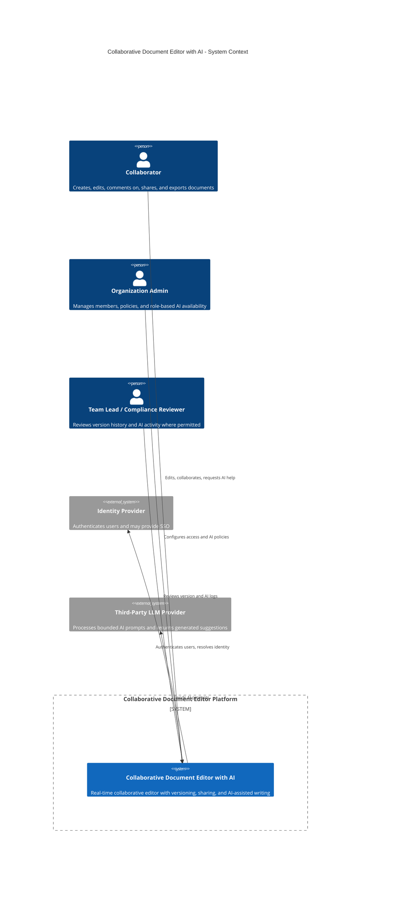
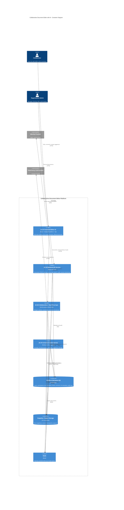
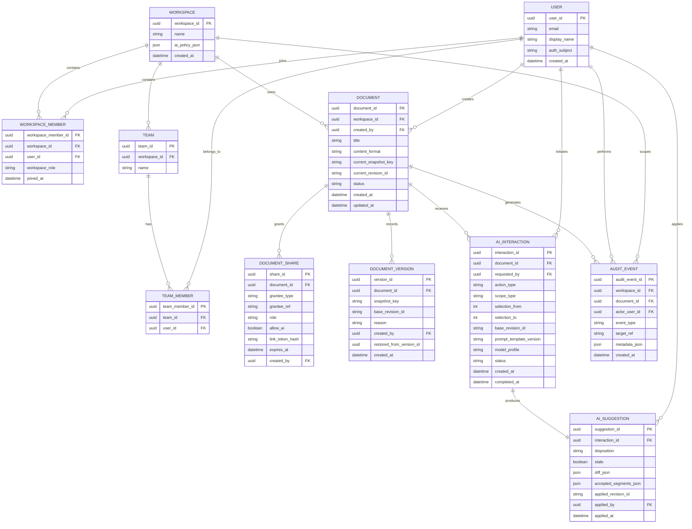

# Part 2: System Architecture

## 2.1 Architectural Drivers

The architecture is driven first by the collaboration experience and only second by implementation convenience. That ranking matters: if the top priority were “ship the simplest CRUD app quickly,” a single synchronous backend with periodic saves would be enough. That would not satisfy the requirements in Part 1, especially FR-COL-01, FR-COL-03, FR-COL-04, NFR-LAT-01, NFR-AVAIL-03, and the AI-review workflows in FR-AI-02 and FR-AI-03.

| Rank | Architectural driver | Requirements that force it | Why it dominates the design |
| --- | --- | --- | --- |
| 1 | Low-latency, consistent real-time collaboration | FR-COL-01, FR-COL-02, FR-COL-03, FR-COL-04, NFR-LAT-01 | The product fails if collaboration feels delayed or if edits are lost. This drives a dedicated real-time synchronization path, local-first editor state, and an algorithm that converges after overlapping edits and reconnects. |
| 2 | Failure isolation and graceful degradation | NFR-AVAIL-01, NFR-AVAIL-02, NFR-AVAIL-03 | The core editor must continue working even if AI is slow or unavailable. This drives a separation between the collaboration path and the AI path, plus asynchronous job handling and reconnection logic. |
| 3 | Security, privacy, and auditable authorization | FR-DOC-03, FR-USER-01, FR-USER-02, FR-AI-04, FR-AI-05, NFR-SEC-01 to NFR-SEC-05 | Sensitive documents and third-party AI processing require explicit policy checks, least-privilege access, audit trails, and bounded prompt construction. |
| 4 | Reviewable, non-destructive AI assistance | FR-AI-02, FR-AI-03, US-07, US-08 | AI output must behave like a proposal, not a silent overwrite. This drives suggestion objects, base-revision tracking, partial acceptance, and stale-suggestion handling during concurrent editing. |
| 5 | Horizontal scalability under document and session growth | NFR-SCALE-01, NFR-SCALE-02, NFR-SCALE-03 | Supporting many active documents and dozens of editors per document requires stateless API scaling, horizontally scalable real-time nodes, and storage that does not assume a single application server. |
| 6 | Team velocity and architectural evolvability | Part 2.3, Part 4 PoC requirements | The team must build a working PoC and continue evolving it across the semester. This drives a monorepo with shared contracts, explicit module boundaries, and a provider abstraction around AI. |

Two different rankings would produce a different design. For example, if cost minimization were ranked above collaboration fidelity, a polling-based editor with no dedicated real-time service and only on-demand AI calls would be plausible. This architecture instead prioritizes a trustworthy live-editing experience and therefore accepts the complexity of a specialized synchronization layer.

## 2.2 System Design using the C4 Model

The architecture uses the same component IDs introduced in Section 1.5:

* **AC-01 Frontend Editor UI**
* **AC-02 Collaboration / Real-Time Sync Service**
* **AC-03 Backend API Service**
* **AC-04 Document Service**
* **AC-05 Versioning Service**
* **AC-06 Auth & Authorization Service**
* **AC-07 AI Orchestration Service**
* **AC-08 AI Provider Adapter**
* **AC-09 Export Service**
* **AC-10 Audit / Activity Log Service**
* **AC-11 Presence Service**
* **AC-12 Document Database / Storage**

At a high level, the system separates the editing path from the AI path. Real-time changes flow through AC-02 for low latency and convergence, while slower AI operations flow through AC-07 so that AI latency or failure does not interrupt normal editing.

### Level 1 - System Context Diagram



**Explanation**
This level shows the platform as a single system. The important architectural observation is that the product depends on two external systems with very different failure and trust characteristics: the identity provider is required for access control, while the LLM provider is optional and must never be allowed to break core document editing.

### Level 2 - Container Diagram



**Explanation**
The container split is intentional. AC-01 is optimized for responsive editing and local recovery. AC-02 handles low-latency synchronization and AC-11 presence tracking. AC-03 owns stable business APIs and security-sensitive resource checks. AC-07 isolates long-running, failure-prone, and cost-sensitive AI work. AC-12 is implemented as a persistence layer combining PostgreSQL for metadata and object storage for snapshots and exports.

#### Container responsibilities, technology choices, and communication

| Container | Main responsibility | Technology choice | Communication |
| --- | --- | --- | --- |
| AC-01 Frontend Editor UI | Rich-text editor, local state, collaborator presence, AI suggestion review | React, TipTap/ProseMirror, Yjs client, TypeScript | HTTPS to AC-03, WebSocket to AC-02 |
| AC-03 Backend API Service | Resource APIs, session bootstrap, permissions, versions, audit, export | NestJS REST API | HTTPS with AC-01, SQL to PostgreSQL, object storage API, Redis publish |
| AC-02 Collaboration / Real-Time Sync Service | Real-time document updates, awareness, reconnect flow, AC-11 Presence Service | Yjs/Hocuspocus-style server over WebSocket | WebSocket with AC-01, Redis pub/sub, storage APIs for snapshots |
| AC-07 AI Orchestration Service | AI job execution, prompt building, policy/quota checks, AI result persistence | Node.js worker/service with queue consumer | Redis queue, SQL/object storage reads, HTTPS to LLM provider |
| AC-12 Document Database / Storage | Persistent metadata, snapshots, versions, exports | PostgreSQL plus S3-compatible object storage | SQL and object storage APIs |
| Redis | Fan-out, presence, and queueing infrastructure | Redis | Internal infrastructure only; not directly exposed to clients |

### Level 3 - Component Diagram for AC-07 AI Orchestration Service

```mermaid
%%{init: {'c4': {'diagramMarginX': 90, 'diagramMarginY': 70, 'c4ShapeMargin': 180, 'boxMargin': 45, 'c4ShapePadding': 18}}}%%
C4Component
title AC-07 AI Orchestration Service - Component Diagram
Container(api, "AC-03 Backend API Service", "NestJS REST API", "Creates AI jobs and reads suggestions")
System_Ext(llm, "Third-Party LLM Provider", "Hosted LLM API")
ContainerDb(db, "Platform Metadata DB", "PostgreSQL", "Policies, AI interactions, suggestion metadata")
ContainerDb(blob, "Snapshot / Export Storage", "S3-compatible object storage", "Snapshots and large artifacts")
Container(sync, "AC-02 Collaboration / Real-Time Sync Service", "WebSocket service", "Publishes job status to collaborators")

Container_Boundary(ai, "AC-07 AI Orchestration Service") {
  Component(policyGuard, "Policy & Quota Guard", "Domain service", "Checks policy, entitlement, and quota")
  Component(requestHandler, "AI Job Handler", "Queue consumer / application service", "Validates jobs and coordinates execution")
  Component(contextResolver, "Context Resolver", "Domain service", "Loads selection context and revision metadata")
  Component(promptRegistry, "Prompt Template Registry", "Versioned template catalog", "Resolves prompt templates and model settings")
  Component(eventPublisher, "Result Publisher", "Event publisher", "Publishes job status events to the session")
  Component(providerAdapter, "AC-08 AI Provider Adapter", "Provider abstraction", "Maps requests and responses to the LLM provider")
  Component(suggestionComposer, "Suggestion Composer", "Diff and proposal builder", "Builds reviewable suggestions and stale/conflict flags")
  Component(auditLogger, "AI Audit Logger", "Persistence component", "Stores interaction records and disposition metadata")
}

UpdateLayoutConfig($c4ShapeInRow="4", $c4BoundaryInRow="1")

Rel(api, requestHandler, "Enqueue AI job")
Rel(requestHandler, policyGuard, "Check policy and quota")
Rel(requestHandler, contextResolver, "Load document context")
Rel(requestHandler, promptRegistry, "Load prompt template")
Rel(requestHandler, providerAdapter, "Call provider adapter")
Rel(providerAdapter, llm, "Generate completion")
Rel(requestHandler, suggestionComposer, "Build reviewable suggestion")
Rel(suggestionComposer, auditLogger, "Persist result metadata")
Rel(auditLogger, db, "Write interaction metadata")
Rel(contextResolver, db, "Read metadata refs")
Rel(contextResolver, blob, "Read large snapshots")
Rel(requestHandler, eventPublisher, "Publish job status")
Rel(eventPublisher, sync, "Push status to collaborators")
```



**Explanation**
This container is responsible for turning an AI request into a reviewable suggestion rather than a direct document mutation. AC-08 hides vendor-specific APIs from the rest of the system. The Context Resolver and Suggestion Composer are critical because they connect AI output back to a specific document range, base revision, and later accept/reject/partial-apply flow.

### Feature Decomposition

The system is decomposed into modules that can be developed and tested with limited coupling. The frontend, API, real-time, AI, and persistence layers all depend on shared contracts, but they do not share runtime state directly.

| Module | What it does | Depends on | Interface exposed to other modules |
| --- | --- | --- | --- |
| AC-01 Frontend Editor UI | Renders the editor, manages local document state, displays collaborator presence, shows AI suggestions, and handles offline/reconnect UX | Shared contracts package, AC-03 APIs, AC-02 session token and WebSocket channel | React components, editor commands, API client methods, WebSocket event handlers |
| AC-02 Collaboration / Real-Time Sync Service | Accepts document updates, merges concurrent edits, distributes remote updates, and hosts AC-11 Presence Service | Redis pub/sub, AC-12 snapshots, session claims from AC-03 | WebSocket room protocol: `doc.update`, `doc.sync`, `presence.update`, `sync.state` |
| AC-11 Presence Service | Tracks who is connected, active cursors, and summarized presence state for crowded documents | AC-02 session room, Redis | Presence payloads to AC-01; collaborator list and cursor metadata |
| AC-03 Backend API Service | Entry point for document CRUD, versioning, sharing, export, session bootstrap, and AI job creation | AC-04, AC-05, AC-06, AC-09, AC-10, AC-07 | REST/JSON endpoints under `/api/...` |
| AC-04 Document Service | Creates documents, loads metadata, resolves current snapshot pointers, and enforces document lifecycle rules | AC-06, AC-12 | Internal service methods and REST handlers such as `POST /documents`, `GET /documents/{id}` |
| AC-05 Versioning Service | Creates immutable checkpoints, lists version history, and restores previous versions as new current versions | AC-04, AC-06, AC-12 | `GET /documents/{id}/versions`, `POST /documents/{id}/versions/{versionId}/restore` |
| AC-06 Auth & Authorization Service | Verifies identity claims, evaluates workspace role plus document role, and gates AI usage by policy | Identity provider claims, workspace policy tables, share records | `authorize(user, action, resource)` and permission metadata returned to the client |
| AC-07 AI Orchestration Service | Executes AI jobs, builds prompts, selects models, and publishes suggestion results | AC-06 policy data, AC-12, AC-08 | AI job queue interface and status events |
| AC-08 AI Provider Adapter | Normalizes calls to the chosen LLM provider and shields the rest of the system from vendor changes | Third-party LLM API | Provider-independent `generate(prompt, schema, modelProfile)` interface |
| AC-09 Export Service | Produces PDF/DOCX exports from the current snapshot and optionally annotates pending AI suggestions | AC-04, AC-05, AC-12 | `POST /documents/{id}/exports` |
| AC-10 Audit / Activity Log Service | Records version restores, sharing changes, AI requests, AI outcomes, and security-relevant events | AC-06, AC-12 | Audit write interface and read APIs for permitted reviewers |
| AC-12 Document Database / Storage | Stores metadata, access rules, versions, snapshots, AI logs, and exports | PostgreSQL, object storage | Persistence contracts used by AC-02, AC-03, and AC-07 |

### AI Integration Design

#### Context and scope

The AI assistant should not always see the full document. The default rule is to send the minimum context necessary for the requested feature.

| AI feature | Context sent to the model | Why this scope is chosen | Long-document handling |
| --- | --- | --- | --- |
| Rewrite | Selected text plus the previous and next paragraph, document title, and style hints | Keeps prompts small while preserving tone and local coherence | If the selection exceeds the token budget, chunk by paragraph and synthesize a final rewrite candidate |
| Summarize | Selected text or the current section; optionally section heading path | Summaries depend on the section, not necessarily the full document | Summarize chunks first, then combine them into a second-stage summary |
| Translate | Selected text plus requested target language and glossary/terminology hints | Translation quality benefits more from term hints than from full-document context | Translate in formatting-preserving chunks if the selection is long |
| Restructure | Section outline plus current section content; full document outline only when small enough | Structural changes need broader context than sentence rewrites | For large documents, first generate an outline from headings and section summaries, then propose section-level restructuring |

This scope policy directly balances cost, relevance, and latency. Full-document prompting is reserved for small documents or outline-only operations because it is the most expensive and slowest option and increases privacy exposure.

#### Suggestion UX

AI output is presented as a reviewable suggestion, never as a silent replacement. The UX has two modes:

* **Inline tracked-change style proposal** for local rewrites, summaries inserted below selection, and translation replacements of a bounded selection.
* **Side-panel proposal** for larger restructures or section-level rewrites where direct inline replacement would be visually disruptive.

Users can:

* accept the full suggestion,
* reject it with no document mutation,
* edit the suggestion text before applying it,
* partially accept it by applying only selected diff blocks or sentences,
* undo an accepted suggestion through normal editor undo and version history.

Each suggestion is tied to a `baseRevisionId` so that the system knows what text the model actually saw.

#### AI during collaboration

The architecture does **not** hard-lock the selected region by default. That would protect consistency but would harm the core collaboration experience. Instead:

1. When a user invokes AI, the selected range is marked locally as `AI pending`, and collaborators can see a lightweight indicator that an AI proposal is being generated.
2. Other collaborators may continue editing the document, including the same region.
3. When the result arrives, the system compares the original `baseRevisionId` and text hash with the latest state.
4. If the region has only changed slightly, the Suggestion Composer rebases the proposal onto the latest revision and shows it as a normal suggestion.
5. If the region has changed substantially, the suggestion is marked `stale` and shown with an explanation such as “The source text changed while the AI was generating. Review before applying.”

This gives all collaborators a predictable experience: work continues, but AI proposals are explicitly treated as proposals against a moving shared state.

#### Prompt design

Prompt logic is **template-based and versioned**, not hardcoded in controller code. Each AI feature has:

* a versioned system prompt,
* task-specific variables such as tone, target language, or structure style,
* response schema instructions so the provider returns structured output where possible,
* guardrails telling the model to preserve facts and avoid unrequested changes.

Prompt templates live in a dedicated prompt catalog package and can also be overridden by a database-backed configuration table for selected workspaces. That means prompt wording can evolve without redeploying the whole application, while prompt versions remain auditable in AI interaction records.

#### Model and cost strategy

The platform uses different model profiles for different AI tasks:

* **Fast/low-cost model** for short rewrite, summarize, and translate requests.
* **Higher-quality model** for restructure and long-context summarization jobs.

Cost is controlled at two levels:

* **Per-user quotas** to prevent one user from exhausting shared capacity.
* **Organization-level budgets and feature policies** so admins can disable expensive features or cap monthly usage.

When a user exceeds the allowed limit, AC-07 returns a quota-specific error and publishes a `quota_exceeded` job state. The editor remains fully usable for manual editing; only new AI requests are blocked until the quota resets or an administrator changes the policy.

### API Design

The API layer uses different interaction styles for different problems:

* **REST/JSON** for stable resource operations such as document CRUD, sharing, versions, export, and policy management.
* **WebSocket** for low-latency collaborative updates and presence because polling would not satisfy NFR-LAT-01.
* **Asynchronous job pattern** for AI because LLM calls are slow, failure-prone, and quota-bound.

#### Document CRUD and versioning

| Method | Path | Purpose | Key request / response fields |
| --- | --- | --- | --- |
| `POST` | `/api/documents` | Create a new document | Request: `title`, `workspaceId`, `initialContent?`; Response: `documentId`, `latestVersionId`, `role`, `content` |
| `GET` | `/api/documents` | List documents visible to the current user | Response: paged list with `documentId`, `title`, `updatedAt`, `role`, `preview` |
| `GET` | `/api/documents/{documentId}` | Load document metadata and current snapshot reference | Response: `documentId`, `title`, `content`, `latestVersionId`, `permissions`, `sharingSummary` |
| `PATCH` | `/api/documents/{documentId}` | Update document metadata or PoC-style non-live content fields | Request: `title?`, `status?`, `content?`; Response: updated document resource |
| `DELETE` | `/api/documents/{documentId}` | Soft-delete or archive a document | Response: `204 No Content` |
| `GET` | `/api/documents/{documentId}/versions` | List immutable checkpoints | Response: array of `versionId`, `createdAt`, `actor`, `reason` |
| `POST` | `/api/documents/{documentId}/versions/{versionId}/restore` | Restore an older version as a new current version | Response: `restoredVersionId`, `latestVersionId`, `restoredFromVersionId` |

Example create contract:

```json
POST /api/documents
{
  "title": "Q2 Launch Plan",
  "workspaceId": "ws_123",
  "initialContent": {
    "type": "doc",
    "content": []
  }
}
```

```json
201 Created
{
  "documentId": "doc_456",
  "title": "Q2 Launch Plan",
  "latestVersionId": "ver_001",
  "role": "owner",
  "contentFormat": "prosemirror-json",
  "content": {
    "type": "doc",
    "content": []
  }
}
```

#### Real-time session management

| Method / channel | Path | Purpose | Key fields |
| --- | --- | --- | --- |
| `POST` | `/api/documents/{documentId}/sessions` | Bootstrap a collaboration session after permission checks | Response: `sessionId`, `websocketUrl`, `realtimeToken`, `baseRevisionId`, `presenceUser` |
| `WS` | `/realtime/documents/{documentId}?token=...` | Join the live editing room | Events: `doc.sync`, `doc.update`, `presence.update`, `sync.state`, `ai.job.status` |

Example session bootstrap response:

```json
{
  "sessionId": "sess_789",
  "websocketUrl": "wss://api.example.com/realtime/documents/doc_456",
  "realtimeToken": "signed-short-lived-token",
  "baseRevisionId": "rev_1042",
  "presenceUser": {
    "userId": "usr_001",
    "displayName": "Alice",
    "color": "#1f6feb"
  }
}
```

Example event envelope:

```json
{
  "type": "ai.job.status",
  "documentId": "doc_456",
  "jobId": "ai_222",
  "status": "ready",
  "suggestionId": "sug_333"
}
```

#### AI assistant invocation

| Method | Path | Purpose | Key request / response fields |
| --- | --- | --- | --- |
| `POST` | `/api/documents/{documentId}/ai-jobs` | Create an AI request against a selection or section | Request: `action`, `scope`, `selectionRange`, `baseRevisionId`, `options`; Response: `jobId`, `status`, `queuedAt`, `quotaRemaining?` |
| `GET` | `/api/ai-jobs/{jobId}` | Fetch current job status when event subscription is unavailable | Response: `status`, `suggestionId?`, `errorCode?`, `message?` |
| `GET` | `/api/ai-jobs/{jobId}/suggestion` | Load the generated suggestion payload | Response: `originalText`, `suggestedText`, `diff`, `baseRevisionId`, `stale` |
| `POST` | `/api/ai-jobs/{jobId}/apply` | Apply all or part of a suggestion | Request: `mode`, `selectedDiffBlocks?`, `targetRevisionId`; Response: `appliedVersionId`, `newRevisionId` |
| `POST` | `/api/ai-jobs/{jobId}/reject` | Explicitly reject a suggestion and persist the outcome | Response: `status: rejected` |

Example AI request:

```json
POST /api/documents/doc_456/ai-jobs
{
  "action": "summarize",
  "scope": "selection",
  "selectionRange": {
    "from": 120,
    "to": 480
  },
  "baseRevisionId": "rev_1042",
  "options": {
    "tone": "professional",
    "targetLanguage": null
  }
}
```

```json
202 Accepted
{
  "jobId": "ai_222",
  "status": "queued",
  "queuedAt": "2026-03-17T10:15:00Z"
}
```

#### User, sharing, and permission management

| Method | Path | Purpose | Key fields |
| --- | --- | --- | --- |
| `GET` | `/api/me` | Load the current user profile and workspace memberships | Response: `userId`, `displayName`, `workspaceRoles`, `featureEntitlements` |
| `POST` | `/api/documents/{documentId}/shares` | Grant user, team, or link-based access | Request: `granteeType`, `granteeIdOrEmail`, `role`, `expiresAt?`, `allowAi?` |
| `PATCH` | `/api/documents/{documentId}/shares/{shareId}` | Modify an existing share rule | Request: `role?`, `expiresAt?`, `allowAi?` |
| `DELETE` | `/api/documents/{documentId}/shares/{shareId}` | Revoke access | Response: `204 No Content` |
| `PATCH` | `/api/workspaces/{workspaceId}/ai-policy` | Change role-based AI feature availability or budgets | Request: `allowedRolesByFeature`, `monthlyBudget`, `perUserQuota` |
| `GET` | `/api/documents/{documentId}/audit` | View audit trail when authorized | Response: array of activity events |

#### Long-running AI operations and error handling

From the client perspective, AI is a job with explicit states: `queued`, `running`, `ready`, `stale`, `failed`, or `quota_exceeded`. The client subscribes to `ai.job.status` events over the existing document session channel; if the WebSocket is unavailable, it falls back to `GET /api/ai-jobs/{jobId}` polling.

This lets the client distinguish:

* **“The AI is slow”**: job remains in `queued` or `running`.
* **“The AI failed”**: job becomes `failed` with `errorCode` such as `AI_PROVIDER_TIMEOUT` or `AI_PROVIDER_UNAVAILABLE`.
* **“You have exceeded your quota”**: request is rejected with HTTP `429` or transitions to `quota_exceeded`.

Other important status codes are:

* `401 Unauthorized` for missing/expired session
* `403 Forbidden` for role or policy restrictions
* `409 Conflict` for stale base revision or apply-on-old-version attempts
* `422 Unprocessable Entity` for invalid selection ranges or malformed requests
* `503 Service Unavailable` when the AI provider is down but the editor itself remains available

### Authentication & Authorization

Authentication is required because the system contains private documents, auditable change history, and quota-controlled AI features. The platform expects several user types:

* workspace members,
* invited external collaborators,
* organization administrators,
* reviewers such as team leads or compliance staff with narrow audit access,
* link-based guests with restricted read or comment permissions.

Document access is controlled by both workspace membership and document-specific sharing rules. The main roles and actions are:

| Role | Read | Comment | Edit | Share | Restore versions | Invoke AI | Review AI history |
| --- | --- | --- | --- | --- | --- | --- | --- |
| Owner | Yes | Yes | Yes | Yes | Yes | Yes | Yes |
| Editor | Yes | Yes | Yes | If granted | If granted | Yes if policy allows | Usually no unless explicitly granted |
| Commenter | Yes | Yes | No | No | No | Optional, policy-controlled | No |
| Viewer | Yes | No | No | No | No | No | No |
| Workspace Admin | Policy-driven across workspace | Policy-driven | Policy-driven | Can manage workspace defaults | Usually by exception | Can configure AI policy | Can review logs where policy permits |

Actions beyond basic read/write are explicitly protected:

* sharing and permission changes,
* version restore,
* export,
* AI invocation,
* AI history review.

Privacy considerations for third-party LLM processing are built into the authorization model. A workspace can disable external AI processing entirely, restrict it to specific roles, or allow only certain features. Even when AI is allowed, the Context Resolver sends the minimum required text rather than the full document by default.

### Communication Model

The system uses a **push-based real-time communication model** for editing and presence, plus a resource API for stable state transitions.

**Why this choice**

* Push-based synchronization gives the best user experience for collaborative editing and is the only realistic way to satisfy the keystroke propagation targets in NFR-LAT-01.
* Polling would simplify the backend but would make simultaneous editing feel laggy and would create more conflict windows.
* The trade-off is greater implementation complexity, especially around reconnection, ordering, and stale suggestions.

**When a user first opens a shared document**

1. AC-01 calls `GET /api/documents/{id}` to load metadata, current permissions, and the latest snapshot reference.
2. AC-01 calls `POST /api/documents/{id}/sessions` to obtain a short-lived real-time token and base revision.
3. The client connects to AC-02 over WebSocket, joins the document room, and receives any missed updates.
4. AC-11 Presence Service broadcasts the current participant list and cursor awareness state.
5. The editor becomes fully interactive once local state and live state are synchronized.

**When connectivity is lost and returns**

* The client keeps the local editing buffer and marks the document as offline or reconnecting.
* Local edits remain in the local CRDT state and are not discarded.
* On reconnect, the client re-authenticates if needed, rejoins the room, exchanges missing updates, and reconciles local operations.
* If the document has moved too far ahead or the token is invalid, the UI requests a safe reload while preserving the unsynced local draft until the user confirms.

## 2.3 Code Structure & Repository Organization

### Monorepo vs. multi-repo

This project should use a **monorepo**.

That choice is justified by the team size and by the amount of shared logic across frontend, backend, real-time, and AI services:

* frontend and backend share document contracts, permission enums, and validation schemas;
* the AI service shares prompt templates, model profiles, and event payload types;
* the PoC in Part 4 needs fast end-to-end iteration without cross-repository release coordination;
* a semester project benefits more from simple refactoring and shared CI than from independent repo autonomy.

A multi-repo setup would make sense for a much larger organization with separate deployment teams, but for this assignment it would add friction without enough benefit.

### Proposed repository tree

```text
softassignment1/
├── apps/
│   ├── web/
│   │   ├── src/
│   │   │   ├── app/
│   │   │   ├── features/
│   │   │   │   ├── editor/
│   │   │   │   ├── presence/
│   │   │   │   ├── ai/
│   │   │   │   ├── sharing/
│   │   │   │   └── versions/
│   │   │   ├── lib/
│   │   │   │   ├── api/
│   │   │   │   ├── realtime/
│   │   │   │   └── auth/
│   │   │   └── test/
│   ├── api/
│   │   ├── src/
│   │   │   ├── modules/
│   │   │   │   ├── documents/
│   │   │   │   ├── versions/
│   │   │   │   ├── shares/
│   │   │   │   ├── authz/
│   │   │   │   ├── audit/
│   │   │   │   └── export/
│   │   │   ├── controllers/
│   │   │   ├── repositories/
│   │   │   └── test/
│   ├── realtime/
│   │   ├── src/
│   │   │   ├── rooms/
│   │   │   ├── presence/
│   │   │   ├── persistence/
│   │   │   └── test/
│   └── ai-worker/
│       ├── src/
│       │   ├── jobs/
│       │   ├── context/
│       │   ├── prompts/
│       │   ├── providers/
│       │   ├── suggestion/
│       │   └── test/
├── packages/
│   ├── contracts/
│   ├── editor-schema/
│   ├── authz-rules/
│   ├── prompt-catalog/
│   ├── shared-config/
│   └── ui/
├── tests/
│   ├── integration/
│   ├── e2e/
│   └── fixtures/
├── infra/
│   ├── docker/
│   ├── compose/
│   ├── migrations/
│   └── env/
├── docs/
│   └── architecture/
├── scripts/
├── .env.example
└── README.md
```

### Directory layout and shared code rationale

| Path | Purpose |
| --- | --- |
| `apps/web` | User-facing editor UI, local editor state, sharing screens, AI review panel, and API/realtime clients |
| `apps/api` | REST API routes, resource controllers, domain services for documents, versions, permissions, audit, and export |
| `apps/realtime` | Dedicated live-collaboration server handling CRDT synchronization and presence |
| `apps/ai-worker` | Queue-driven AI orchestration logic, context resolution, prompt assembly, provider adapters, and suggestion composition |
| `packages/contracts` | Shared TypeScript types and runtime validation schemas for API requests, responses, and event payloads |
| `packages/editor-schema` | Shared editor node schema, content serialization helpers, and selection range utilities |
| `packages/authz-rules` | Permission matrix, action enums, and policy evaluation helpers reused in API and UI gating |
| `packages/prompt-catalog` | Versioned prompt templates and model profiles |
| `packages/shared-config` | Environment parsing, feature flags, and service discovery configuration |
| `tests` | Cross-app integration tests, end-to-end scenarios, and reusable fixtures |
| `infra` | Local development containers, database migrations, and deployment-related manifests |
| `docs/architecture` | Mermaid source files, ADRs, and exported diagram artifacts used in the report |

### Configuration management

Secrets such as API keys, database URLs, session secrets, and LLM credentials do **not** live in source control. The repository includes:

* `.env.example` with placeholder names only,
* strongly validated runtime configuration in `packages/shared-config`,
* environment-specific secret injection through the deployment platform or secret manager.

This keeps local setup understandable without leaking actual credentials.

### Testing structure

Tests are placed close to source for unit tests and in top-level `tests/` for cross-service scenarios:

* **Unit tests** beside modules in each app for pure logic such as permission evaluation, prompt assembly, or version-restore rules.
* **Integration tests** in `tests/integration` for document CRUD, sharing enforcement, version restore, and AI job lifecycle with a fake provider.
* **End-to-end tests** in `tests/e2e` for browser-driven flows such as create document, join session, request AI summary, and accept a suggestion.

AI integration should not call a real model in every test run. The default test strategy uses:

* a fake AC-08 provider adapter returning deterministic structured outputs,
* snapshot tests for prompt templates and response parsing,
* a small manual or nightly smoke test against the real provider to detect API drift.

## 2.4 Data Model

### Entity-relationship diagram



### How a document is represented in storage

The current document state is represented by:

* metadata in the `DOCUMENT` table,
* a `current_snapshot_key` pointing to the latest serialized editor snapshot in object storage,
* a `current_revision_id` used by the real-time and AI systems to detect stale operations.

This split is deliberate. CRDT/editor snapshots can be large and change frequently, while metadata and permissions need relational queries and server-side authorization checks.

Beyond raw content, a document stores:

* title,
* workspace ownership,
* creator,
* content format,
* status such as active or archived,
* current revision reference,
* creation and update timestamps.

### Versioning, history visibility, and restore

Version history is modeled through `DOCUMENT_VERSION` as immutable checkpoints. A new checkpoint is created:

* when a user explicitly restores a version,
* when a major AI suggestion is applied,
* on explicit export or save milestones,
* periodically after a threshold such as every 100 operations or after an idle window.

Users with the right permission can list versions and restore one. Restore does **not** delete later history. Instead, the restored snapshot becomes a new current version with `restored_from_version_id` referencing the source checkpoint. That preserves auditability and matches US-03.

### AI interaction history and suggestion tracking

AI activity is split into two related entities:

* `AI_INTERACTION` records the request, who initiated it, the feature used, the source range, template version, model profile, and status.
* `AI_SUGGESTION` records the generated proposal, structured diff, stale flag, disposition, and whether all or part of the suggestion was applied.

Partial acceptance is tracked through `accepted_segments_json`, which stores the subset of diff blocks the user accepted. This lets the system distinguish:

* accepted in full,
* rejected,
* partially applied,
* generated but never applied,
* stale because the source region changed too much before review.

### Permissions and sharing model

Permissions are modeled through `DOCUMENT_SHARE` plus workspace membership:

* `grantee_type = USER` supports direct user sharing,
* `grantee_type = TEAM` supports team-level sharing,
* `grantee_type = LINK` supports link-based access with a hashed token and optional expiry.

Each share rule stores the granted role and whether AI invocation is allowed for that share. Effective permission is computed from workspace role, document share, and workspace AI policy.

## 2.5 Architecture Decision Records (ADRs)

### ADR-01: Use a dedicated CRDT-based real-time synchronization service

**Status:** Accepted

**Context:**  
The platform must support simultaneous editing, overlapping edits, offline recovery, and fast keystroke propagation. A normal REST save endpoint is not sufficient for FR-COL-01, FR-COL-03, FR-COL-04, or NFR-LAT-01.

**Decision:**  
Use a dedicated real-time synchronization service based on a CRDT-capable editor state and WebSocket transport. Clients keep local-first document state and synchronize deltas through AC-02 instead of treating the backend API as the primary write path for every keystroke.

**Consequences:**  
Positive: better convergence for concurrent edits, strong reconnect story, and low-latency propagation.  
Negative: more operational complexity, binary snapshot persistence, and more difficult debugging than simple CRUD updates.

**Alternatives considered:**  
Operational transform in the main API service was considered, but it would put collaboration and REST concerns into the same scaling unit. Polling plus whole-document save was rejected because it would fail the latency and offline requirements.

### ADR-02: Isolate AI into an asynchronous orchestration service

**Status:** Accepted

**Context:**  
LLM requests are slow, quota-limited, occasionally unavailable, and involve external processing. Core editing must remain available during AI slowdown or provider outages.

**Decision:**  
Run AI requests through AC-07 as asynchronous jobs. The backend API creates a job and returns immediately. AC-07 resolves context, applies policy and quota checks, calls the provider through AC-08, stores the result, and publishes status events back to the document session.

**Consequences:**  
Positive: AI failures do not break editing, retries and rate limiting are easier, and provider changes are localized.  
Negative: the client must handle more states such as queued, running, stale, and quota exceeded.

**Alternatives considered:**  
Direct synchronous LLM calls inside AC-03 were rejected because they would couple API latency and availability to the provider. Direct client-to-provider calls were rejected because they would leak credentials, weaken policy enforcement, and reduce auditability.

### ADR-03: Treat AI output as reviewable suggestion objects tied to base revisions

**Status:** Accepted

**Context:**  
Users need to trust the editor, partially accept suggestions, undo changes, and collaborate while AI is generating. Silent replacement would violate FR-AI-02, FR-AI-03, US-07, and US-08.

**Decision:**  
Store AI outputs as structured suggestion objects that reference the original selection and `baseRevisionId`. Suggestions must be explicitly accepted, rejected, or partially applied. If the source region changes significantly before review, the suggestion is marked stale instead of being auto-applied.

**Consequences:**  
Positive: better user control, stronger audit trail, safer collaboration, and simpler version reasoning.  
Negative: extra UI complexity, additional persistence, and a more complex apply flow than “replace text immediately.”

**Alternatives considered:**  
Immediate AI overwrite was rejected as too risky. A loose side panel with no persisted suggestion object was rejected because it would make auditability, partial acceptance, and collaboration conflict handling much weaker.

### ADR-04: Use a TypeScript monorepo with shared contracts and prompt catalog packages

**Status:** Accepted

**Context:**  
The same project needs a web app, API, real-time service, AI worker, shared schemas, and a working PoC. The team is small and benefits from fast refactoring and one CI pipeline more than from strict repository separation.

**Decision:**  
Keep all applications and shared packages in one monorepo. Shared API contracts, editor schema helpers, authorization rules, and prompt templates live in reusable packages rather than being copied between services.

**Consequences:**  
Positive: simpler cross-cutting changes, fewer schema mismatches, faster onboarding, and easier alignment between Part 2 architecture and Part 4 code.  
Negative: a larger repository, the need for careful package boundaries, and potentially broader CI runs unless pipelines are scoped.

**Alternatives considered:**  
Separate frontend and backend repositories were considered, but they would create avoidable coordination overhead for a semester project. Copying schemas between services was rejected because it would almost guarantee drift between architecture, backend implementation, and frontend expectations.
